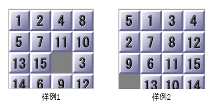
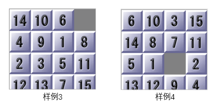
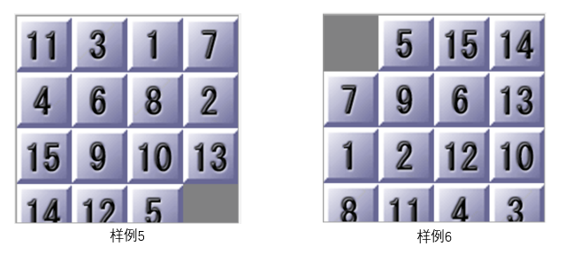

中山大学计算机学院人工智能本科生实验报告

**（2023学年春季学期）**

课程名称：Artificial Intelligence

| 教学班级   | 人工智能         | 专业（方向） | 计算机科学与技术 |
| ------ | ------------ | ------ | -------- |
| **学号** | **21307387** | **姓名** | **陈雪玮**  |

# 一、实验题目

分别用Astar和IDAstar算法解决15-puzzles问题

# 二、实验内容

## 1.算法原理

**Astar算法原理**

Astar是在盲目搜索的广度优先搜索上加入启发信息实现的.这里的启发信息就是估值函数,定义为$f(n)=g(n)+h(n)$,$g(n)$为从初始状态到当前状态的花费,$h(n)$为当前状态到目标状态的启发式信息.从初始状态开始广度优先搜索,将待访问结点放入Open表(一般是优先队列),访问过的结点放入Close表,以每个结点的估值函数大小升序排列(**这就是和BFS的本质不同**)依次以广度优先的方式访问,直至到达目标状态.

**IDAstar算法原理**

IDAstar是在盲目搜索算的迭代加深搜索上加入启发信息实现的.启发信息与Astar一样,设定初始的深度限制bound,这里是初始状态的启发式函数值.以深度优先的方式,以估值函数大小升序的顺序进行递归搜索(**这就是和迭代加深搜索的本质不同**),若当前状态的估值函数大于bound,则返回当前的值;若不大于,则继续以深度优先的方式搜索.若在当前的深度没有到达目标状态,则以超过bound的最小的值作为新的bound,进行新的一轮搜索.

**两个算法的优缺点**

Astar需要更多的内存空间,IDAstar虽然使用空间更少,但每次更新深度限制后,都要再次从初始状态开始搜索,这将重复搜索已搜索过的状态,因此会增加时间耗费.

## 2.伪代码或流程图

Astar算法

```python
Procedure Astar
Begin
    建立Path用于记录每个结点的父结点
    建立Open表,Close表.Open表用优先队列,以估值函数大小升序;Close表用集合,便于查找.
    将初始结点S0放入Open表
    While Open表不空 Do
    Begin
        从Open中取出f(n)最小的结点n,将n从Open表中删除并放入Close表中
        If n是目标结点
            Then 记录n的父结点,根据Path输出解的路径,算法结束
        Else
        Begin
            拓展结点n,若由n拓展的子结点不在Open表和Close表中,
            计算它们的f(n),将子结点放入Open表中.记录子结点的父结点是n.
            若子结点在Open表或Close表中,则说明有多个父结点,指向f(n)最小的父结点
        End
    End
End
```

IDAstar算法

```python
bound = 初始节点的启发函数大小
定义搜索路径记录PATH

Procedure IDAsearch
Begin
    从给定的buond开始搜索
    假设当前超过bound的搜索深度下界为new_depth = 无穷大
    PATH加入当前结点
    if 到达最终状态 Then 返回0
    Else
    Begin
        遍历当前结点的所有邻居结点,计算它们的估值函数大小f(n)
        if f(n) > bound Then return f(n)
        Else 没有超过最大深度限制
        Begin
            深度优先,从当前结点继续往深度搜索
            更新当前搜索的最大深度cur_depth
            if 到达最终状态 Then 返回0
            if cur_depth < new_depth Then new_depth = cur_depth
            PATH.pop()
        End
    End
    return new_depth
End

bound = new_depth
执行IDAstar直到找到目标,输出解的路径PATH.
```

## 3.关键代码展示（带注释）

Astar的关键代码

```python
# 状态
class S:
    def __init__(self, gn=0, hn=0, state=None):
        self.gn = gn
        self.hn = hn
        self.fn = self.gn + self.hn
        self.state = state

    def __lt__(self, s):  # 定义小根堆，比较优先级是fn、hn、gn
        if self.fn == s.fn:
            return self.hn < s.hn  # 如果总代价相等，选择估值小的
        return self.fn < s.fn


def Astar(h, ini_state):  # h是启发函数,ini_state是初始状态
    if not solvable(ini_state):
        return False
    # Close表 记录访问过的棋盘
    PATH.clear()  # 初始化路径记录列表
    CLOSE = list()
    # Open表，先采用列表，后面采用优先队列优化
    OPEN = PriorityQueue()
    # 建立映射 
    state_index = dict()# 棋盘到下标
    index_state = dict()# 下标到棋盘
    state_parent = dict()# 当前棋盘到其父亲棋盘的下标
    index = 0

    hn = h(ini_state)
    new_S = S(0, hn, ini_state)
    OPEN.put(new_S)
    state_parent[str(ini_state)] = -1  # 初始化最初态的父亲下标为-1
    while not OPEN.empty():
        cur_S = OPEN.get()
        cur_gn = cur_S.gn
        cur_state = cur_S.state
        # 得到当前棋盘空格的坐标
        cur_index = getblock(cur_state)
        cur_x, cur_y = cur_index[0], cur_index[1]
        CLOSE.append(cur_state)
        # 当前棋盘映射到一个下标
        state_index[str(cur_state)] = index
        index_state[index] = cur_state
        index += 1
        # 产生新状态
        for i in range(4):
            new_x = cur_x + dx[i]
            new_y = cur_y + dy[i]
            if 0 <= new_x <= 3 and 0 <= new_y <= 3:
                new_state = copy.deepcopy(cur_state)
                # 移动空格
                new_state[cur_x][cur_y], new_state[new_x][new_y] = new_state[new_x][new_y], new_state[cur_x][cur_y]
                if new_state not in CLOSE:
                    new_hn = h(new_state)
                    new_gn = cur_gn + 1               
                    OPEN.put(new_S)
                    # 当前棋盘父亲的下标
                    state_parent[str(new_state)] = state_index[str(cur_state)]
                    if new_hn == 0:  # 输出过程
                        # 加入PATH中寻找得出答案的路径 为了实现这个 需要将每一次的state建立一个哈希表 并且记录父亲的下标
                        index_state[index] = new_state  # 终点的下标
                        state_index[str(new_state)] = index
                        format_output(index_state, state_parent, index)
                        global Nodes_num # 拓展结点数
                        Nodes_num = OPEN.qsize() + len(CLOSE) - 1
                        return True
```

IDAstar的关键代码

```python
# DFS
def IDAsearch(bound, ini_state, gn, h):  # 函数定义为搜索当前状态，并且深入搜索下一状态
    global Nodes_num
    Nodes_num += 1
    new_depth = sys.maxsize
    PATH.append(ini_state)  # 搜索路径
    # 设定base case
    if ini_state == end_state:
        return 0
    # 深度优先搜索 不是最终状态
    for cur_state in get_state(ini_state, h):
        hn = h(cur_state)
        fn = hn + gn
        # 深度限制 fn如果大于bound 就返回fn 用于搜索失败后更新深度
        if fn > bound:
            return fn
        # 否则继续深搜，并且得到子状态中超过bound最小的深度（如果有）
        cur_depth = IDAsearch(bound, cur_state, gn + 1, h)  # 继续搜索，注意gn+1
        if cur_depth == 0:
            return 0
        if cur_depth < new_depth:  # 最小更新bound
            new_depth = cur_depth
        # 当前棋盘不是解的路径上的
        PATH.pop()
    return new_depth

# 决策
# 估值函数fn = gn + hn gn定义为走的步数 hn定义为曼哈顿距离
# IDAstar 深度设定为启发式函数的价值
def IDAstar(h, ini_state):# h是启发函数,ini_state是初始状态
    if not solvable(ini_state):
        return False
    global Nodes_num #拓展结点数
    Nodes_num = -1
    bound = h(ini_state)
    while True:
        PATH.clear()
        depth = IDAsearch(bound, ini_state, 0, h)  # 更新深度
        if depth == 0:
            # 输出结果
            format_output()
            return True
        else:
            bound = depth
```

启发函数的关键代码

```python
end_state = [[1, 2, 3, 4], [5, 6, 7, 8], [9, 10, 11, 12], [13, 14, 15, 0]]

#曼哈顿距离
def manhattan(cur_state):
    distance = 0
    for i in range(4):
        for j in range(4):
            if cur_state[i][j] == end_state[i][j] or cur_state[i][j] == 0:
                continue
            else:
                end_x = (cur_state[i][j] - 1) // 4
                end_y = (cur_state[i][j] - 1) % 4
                distance += abs(i - end_x) + abs(j - end_y)
    return distance

#切比雪夫距离
def chebyshev(cur_state):
    distance = 0
    for i in range(4):
        for j in range(4):
            if cur_state[i][j] == end_state[i][j] or cur_state[i][j] == 0:
                continue
            else:
                end_x = (cur_state[i][j] - 1) // 4
                end_y = (cur_state[i][j] - 1) % 4
                distance += max(abs(i - end_x), abs(j - end_y))
    return distance

#欧几里得距离
def euclidean(cur_state):
    distance = 0
    for i in range(4):
        for j in range(4):
            if cur_state[i][j] == end_state[i][j] or cur_state[i][j] == 0:
                continue
            else:
                end_x = (cur_state[i][j] - 1) // 4
                end_y = (cur_state[i][j] - 1) % 4
                distance += (i - end_x) ** 2 + (j - end_y) ** 2
    return distance ** 0.5

#错位数
def misplaced(cur_state):
    distance = 0
    for i in range(4):
        for j in range(4):
            if cur_state[i][j] == end_state[i][j] or cur_state[i][j] == 0:
                continue
            else:
                end_x = (cur_state[i][j] - 1) // 4
                end_y = (cur_state[i][j] - 1) % 4
                if i != end_x or j != end_y:
                    distance += 1
    return distance
```

实现可视化:这里使用了tkinter库来实现可视化,创建了一个GUI类.

```python
class GUI:
    def __init__(self, state_set):
        self.state_set = state_set  # 解的路径的集合
        self.root = tk.Tk()
        self.root.title('15-Puzzle Solver')
        # 初始化布局，每个格子100*100，总共需要400*400的总界面
        self.board_canvas = tk.Canvas(self.root, width=400, height=400, borderwidth=0, relief='ridge')
        self.board_canvas.pack(side=tk.LEFT, padx=25, pady=25)
        # 将显示每一步的步骤在侧边栏
        self.step_listbox = tk.Listbox(self.root, width=25, height=20, relief='ridge')
        self.step_listbox.pack(side=tk.RIGHT, padx=20, pady=10)

    # 绘制每一个状态的图形界面
    def draw_cur_state(self, cur_state):
        # 设定格子的坐标
        for row_index, row in enumerate(cur_state):
            for col_index, num in enumerate(row):
                x0 = col_index * 100
                y0 = row_index * 100
                x1 = x0 + 100
                y1 = y0 + 100

                if num == 0:
                    # Draw an empty cell
                    self.board_canvas.create_rectangle(x0, y0, x1, y1, fill='white', outline='black')
                else:
                    # Draw a cell with text inside
                    self.board_canvas.create_rectangle(x0, y0, x1, y1, fill='gray', outline='black')
                    self.board_canvas.create_text(x0 + 50, y0 + 50, text=str(num), font=('Arial', 25, 'bold'))

    # 通过解的集合更新每一个状态的过程
    def update_cur_state(self):
        for step, cur_state in enumerate(self.state_set):
            self.step_listbox.insert(tk.END, 'move %d' % step)
            for row in cur_state:
                self.step_listbox.insert(tk.END, str(row))
            self.step_listbox.insert(tk.END, '')  # 相当于空行
            self.step_listbox.yview_moveto(1.0)  # 将列表框滚动到最底部
            # 插入文本后绘制界面
            self.draw_cur_state(cur_state)
            self.root.update()
            time.sleep(0.5)

    def run(self, runtime):
        self.update_cur_state()
        self.step_listbox.insert(tk.END, 'Runing time is %.2f' % runtime)
        self.step_listbox.yview_moveto(1.0)  # 将列表框滚动到最底部
        self.step_listbox.insert(tk.END, 'Total steps % d' % (len(PATH) - 1))
        self.step_listbox.yview_moveto(1.0)  # 将列表框滚动到最底部
        self.root.mainloop()
```

## 4.创新点&优化（如果有）

1. **Close表数据结构的选择**:在Astar搜索算法中维护的Close表起到了环检测的作用,使用set而不是list来进行查找时间花费更少.

2. **启发函数的设计**:基于f(x) = g(x) + h(x)，面对困难的情况时，我们难以在限定时间内取得最优解，因此我们可以适当增加h(x)的比重，增加运行速度，又能接近最优解.

3. **实现了可视化界面**:如果该十五数码问题有解,则显示完整的解决过程,并且界面旁边的空白栏会有记录.

# 三、实验结果及分析

## 1.实验结果展示示例（可图可表可文字，尽量可视化）

一共六个测试样例：





以可视化过程展示六个样例成功解决的过程(**样例3无解**)，使用IDAstar算法,启发函数是两倍的曼哈顿距离,展示视频在文件夹`reslut`中.

不同启发函数以及Astar与IDAstar算法对结果的对比在下面的部分对比分析。

## 2.评测指标展示及分析（机器学习实验必须有此项，其它可分析运行时间等）

**结果:**

| 启发函数:错位方块数      | 样例      | 1           | 2           | 3   | 4           | 5           | 6           |
| --------------- | ------- | ----------- | ----------- | --- | ----------- | ----------- | ----------- |
| [Astar/IDAstar] | 步数/步    | 22/22       | 15/15       | 无解  | -1/-1       | -1/-1       | -1/-1       |
| [Astar/IDAstar] | 拓展节点数/个 | 12053/16427 | 78/59       | 无解  | -1/-1       | -1/-1       | -1/-1       |
| [Astar/IDAstar] | 运行时间/s  | 3.165/0.009 | 0.004/0.006 | 无解  | >1800/>1800 | >1800/>1800 | >1800/>1800 |

| 启发函数:标准曼哈顿距离    | 样例      | 1           | 2           | 3   | 4             | 5           | 6           |
| --------------- | ------- | ----------- | ----------- | --- | ------------- | ----------- | ----------- |
| [Astar/IDAstar] | 步数/步    | 22/22       | 15/15       | 无解  | -1/-1         | -1/-1       | -1/-1       |
| [Astar/IDAstar] | 拓展节点数/个 | 191/90      | 39/19       | 无解  | -1/-1         | -1/-1       | -1/-1       |
| [Astar/IDAstar] | 运行时间/s  | 0.008/0.009 | 0.002/0.002 | 无解  | >1800/790.632 | >1800/>1800 | >1800/>1800 |

| 启发函数:标准切比雪夫距离   | 样例      | 1           | 2           | 3   | 4           | 5           | 6           |
| --------------- | ------- | ----------- | ----------- | --- | ----------- | ----------- | ----------- |
| [Astar/IDAstar] | 步数/步    | 22/22       | 15/15       | 无解  | -1/-1       | -1/-1       | -1/-1       |
| [Astar/IDAstar] | 拓展节点数/个 | 1227/1480   | 44/38       | 无解  | -1/-1       | -1/-1       | -1/-1       |
| [Astar/IDAstar] | 运行时间/s  | 0.062/0.099 | 0.002/0.003 | 无解  | >1800/>1800 | >1800/>1800 | >1800/>1800 |

| 启发函数:标准欧几里得距离   | 样例      | 1           | 2           | 3   | 4           | 5           | 6           |
| --------------- | ------- | ----------- | ----------- | --- | ----------- | ----------- | ----------- |
| [Astar/IDAstar] | 步数/步    | -1/-1       | -1/-1       | 无解  | -1/-1       | -1/-1       | -1/-1       |
| [Astar/IDAstar] | 拓展节点数/个 | -1/-1       | -1/-1       | 无解  | -1/-1       | -1/-1       | -1/-1       |
| [Astar/IDAstar] | 运行时间/s  | >1800/>1800 | >1800/>1800 | 无解  | >1800/>1800 | >1800/>1800 | >1800/>1800 |

分析以上结果可知，

从**启发函数**来看,除了标准欧几里得距离,其余的启发函数都可以在理想的时间内得到样例1、样例2的结果.而其中标准曼哈顿距离的结果最优,能得到最少的步数、拓展节点数和运行时间。

从**算法**来看,除了错位方块数Astar优于IDAstar，其余启发函数中IDAStar的步数、拓展结点和运行时间总体上优于Astar。特别当启发函数是曼哈顿距离时，**样例4**IDAstar最终到达目标状态花费时间快于Astar的两倍有余。

总体而言，曼哈顿距离是相对最好的启发式函数，IDAstar的性能优于Astar。

**优化结果对比分析**:

**启发函数:（这里的Close表还是用list）**

通过以上几个启发函数的对比,结果最好的是曼哈顿距离,因此下面只对曼哈顿距离进行调整.

其中样例1和2较为简单,样例3无解,因此主要针对简单样例4,困难样例5和6进行对比分析.

**样例4**

[Astar/IDAstar]

| 启发函数     | 步数/步    | 拓展节点数/个     | 运行时间/s        |
| -------- | ------- | ----------- | ------------- |
| 标准曼哈顿距离  | -1/-1   | -1/-1       | >1800/790.632 |
| 两倍曼哈顿距离  | 58/58   | 23446/9094  | 16.446/0.701  |
| 五倍曼哈顿距离  | 88/128  | 31211/29886 | 32.516/2.291  |
| 十倍曼哈顿距离  | 108/258 | 3418/165514 | 0.264/14.260  |
| 五十倍曼哈顿距离 | 116/栈溢出 | 3767/栈溢出    | 0.291/栈溢出     |

**样例5**

[Astar/IDAstar]

| 启发函数     | 步数/步    | 拓展节点数/个    | 运行时间/s       |
| -------- | ------- | ---------- | ------------ |
| 标准曼哈顿距离  | -1/-1   | -1/-1      | >1800/>1800  |
| 两倍曼哈顿距离  | -1/62   | -1/166474  | >1800/11.589 |
| 五倍曼哈顿距离  | 100/148 | 8983/21073 | 1.630/2.073  |
| 十倍曼哈顿距离  | 152/288 | 24018/667  | 15.564/0.085 |
| 五十倍曼哈顿距离 | 246/栈溢出 | 16898/栈溢出  | 7.050/栈溢出    |

**样例6**

[Astar/IDAstar]

| 启发函数     | 步数/步    | 拓展节点数/个    | 运行时间/s       |
| -------- | ------- | ---------- | ------------ |
| 标准曼哈顿距离  | -1/-1   | -1/-1      | >1800/>1800  |
| 两倍曼哈顿距离  | -1/78   | -1/342428  | >1800/26.780 |
| 五倍曼哈顿距离  | 132/184 | 3314/1948  | 0.291/0.206  |
| 十倍曼哈顿距离  | 158/354 | 13301/7257 | 4.125/0.718  |
| 五十倍曼哈顿距离 | 146/栈溢出 | 3381/栈溢出   | 0.362/栈溢出    |

**将Close改为set，并且出现的位置都作相应的修改。**

```python
CLOSE = set()
CLOSE.add(str(cur_state))
if str(new_state) not in CLOSE:
```

测试启发函数为两倍曼哈顿距离的结果：

**样例4**

|        | list   | set   |
| ------ | ------ | ----- |
| 运行时间/s | 16.446 | 0.944 |

**样例5**

|        | list  | set    |
| ------ | ----- | ------ |
| 运行时间/s | >1800 | 15.446 |

**样例6**

|        | list  | set    |
| ------ | ----- | ------ |
| 运行时间/s | >1800 | 13.730 |

综合以上结果和启发函数的原理分析，

从启发式函数来看,$h(n)$的权重增大,查找速度变快,但可能不是最短路径,拓展结点数也增多.增加$h(n)$的权重将提高查找速度,但相应的可能无法保证找到最优解.这是因为$h(n)$的权重越大,越接近于贪婪算法.而当$h(n)>>g(n)$时,可以看作贪婪算法.从以上的结果可以看出,10倍曼哈顿距离和50倍曼哈顿距离结果接近.而2倍的曼哈顿距离,既能在较快时间内到达目标状态,也能接近最短路径.

| h(n) 的值         | 描述                      | 性能变化           |
| --------------- | ----------------------- | -------------- |
| $h(n) = 0$      | 只有g(n)起作用，退化为Dijkstra算法 | 保证找到最短路径       |
| $h(n) < h^*(n)$ |                         | 保证能找到最短路径      |
| $h(n) = h^*(n)$ | 只遵循最佳路径不会扩展其它节点         | 运行速度快并且能找到最短路径 |
| $h(n) > h^*(n)$ |                         | 不能保证找到最短路径     |

从set优化来看,优化了set之后,两倍曼哈顿距离下,Astar的运行时间得到了非常大的提升!这是因为在list中搜索的时间复杂度是$O(n)$,而set是$O(1)$,当结点较少时,二者并无太大区别;但情况变得困难时,结点数以指数形式增多,此时set的查找效率远远优于list.

**|-----------如有优化，请重复1，2，分析优化后的算法结果-----------------------|**

# 四、思考题

# 五、参考资料

[【人工智能大作业】A*和IDA*搜索算法解决十五数码（15-puzzle）问题 （Python实现）（启发式搜索）_Maxwell-Wong的博客-CSDN博客](https://blog.csdn.net/m0_52387305/article/details/123531945)

[用A*算法解决十五数码问题（人工智能作业）_扩展节点数和生成节点数怎么算_编程小白呀的博客-CSDN博客](https://blog.csdn.net/weixin_40433003/article/details/122168481)

[机器学习——各种距离度量方法总结_机器学习中常用的距离度量方法_QxwOnly的博客-CSDN博客](https://blog.csdn.net/qs17809259715/article/details/96110056)

[【Pygame基本使用】_pygame使用_chagelo的博客-CSDN博客](https://blog.csdn.net/UoweMee/article/details/94441453)

[对于DFS，BFS，A*与IDA*等寻路算法的总结跟感悟_瞎子怎么寻路_漏れた玩具的博客-CSDN博客](https://blog.csdn.net/ljt735029684/article/details/78945098)

[A*算法中启发函数H的选取 - 知乎 (zhihu.com)](https://zhuanlan.zhihu.com/p/148460520)

[判断N 数码是否有解 牛人总结 归并排序_n数码问题判断是否有解_chasexie(xiehonghao)的博客-CSDN博客](https://blog.csdn.net/hnust_xiehonghao/article/details/7951173)