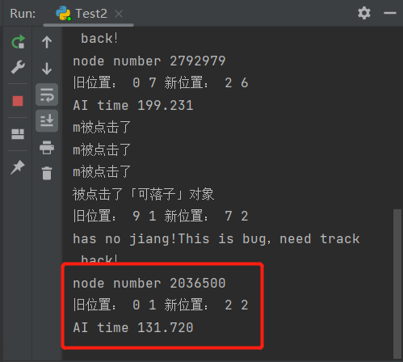

中山大学计算机学院人工智能本科生实验报告

**（2023学年春季学期）**

课程名称：Artificial Intelligence

| 教学班级   | 人工智能         | 专业（方向） | 计算机科学与技术 |
| ------ | ------------ | ------ | -------- |
| **学号** | **21307387** | **姓名** | **陈雪玮**  |

# 一、实验题目

博弈树搜索——用Alpha-Beta剪枝算法设计一个中国象棋博弈程序。

# 二、实验内容

## 1.算法原理

**Max-Min搜索**

在博弈树上交替进行Max和Min结点操作，从而寻找最优解。

在博弈树的每一个节点处，使用评估函数，对当前结点进行评分。Max会选择得分最高的子结点作为自己的值，Min会选择得分最小的子结点作为自己的值。在有深度限制时，Max-Min交替进行深度优先搜索，直到最大深度的结点，计算出该状态的价值，然后回溯至根节点，将所有路径经过结点的价值取最大或最小值，作为该状态的价值，并作出博弈树决策。

Max-Min搜索是完整的算法，可以保证最优解。但随着博弈的进行，博弈树的结点数指数增长，搜索时间指数增加，因此需要剪枝优化。

**Alpha-Beta剪枝优化**

剪掉不可能影响决策的分支，尽可能消除部分搜索树。Alpha-Beta剪枝算法通过对Min-Max搜索树的遍历，利用两个额外的参数**alpha**和**beta**，**alpha是Max下界，beta是Min结点上界，当Max下界大于Min上界时，剪枝。**

Max结点记录alpha值，Min结点记录beta值。对Max结点进行alpha剪枝，当它的评估函数得分大于仍和祖先Min结点的brta值时，进行剪枝；对Min结点进行beta剪枝，于alpha剪枝类似。

由于Alpha-Beta剪枝算法可以动态剪除会导致局面更差的走法，因此它能够极大减少搜索的时间和运算量，并且找到跟完整搜索结果非常相近的解决方案，虽然不保证能找到最优解。

**实现中国象棋**

将以上算法用在中国象棋上，每一个棋局状态就是结点；评估函数可以由棋力、棋子位置、棋子灵活性等等来评价；进行博弈树搜索就是对每一种走法都进行考虑，并使用alpha-beta剪枝优化。

## 2.伪代码

alpha-beta剪枝的Max-Min搜索算法

```python
Procedure alpha_beta(depth, alpha, beta, node, team)
Begin
    if depth到达最大深度 then:
        return 当前局面评估值
    得到当前局面的所有子结点node_children
    if 当前是Max then：
        value = -infinite
        for node_child in node_children do:
            # 深度优先搜索
            value = max(value, alpha_beta(depth+1, alpha, beta, node_child, Min)
            alpha = max(alpha, value)
            # alpha剪枝
            if alpha >= beta then:
                break
            return value
    elif 当前是Min then：
        value = +infinite
        for node_child in node_children do:
            # 深度优先搜索
            value = min(value, alpha_beta(depth+1, alpha, beta, node_child, Min)
            beta = min(alpha, value)
            # beta剪枝
            if alpha >= beta then:
                break
            return beta         
```

## 3.关键代码展示（带注释）

整体实现的代码框架参考以下网站。

[Python3+pygame中国象棋 代码完整 非常好 有效果演示_可可爱爱的程序员的博客-CSDN博客](https://blog.csdn.net/qq_60168783/article/details/121407285)

关键带码主要实现alpha-beta剪枝部分，如下。

```python
    def alpha_beta(self, depth, alpha, beta, chessboard, team):
        self.node_num+=1
        # 如果已经达到预设的最大搜索深度，则返回当前状态的估值
        if depth >= self.max_depth or chessboard.get_general_position(self.get_nxt_player(team)) is None or chessboard.judge_win(self.get_nxt_player(team)):
            return self.evaluate_class.evaluate(chessboard)

        # 获得所有棋子，对每个棋子能走的每个位置进行价值评估，通过剪枝选择价值最高的走法
        # 注意：这里只考虑在当前队伍下能走的棋子，以及当前队伍的颜色
        chesses = chessboard.get_chess()  # 获得当前棋盘所有的棋子
        for chess in chesses:  # 遍历所有棋子
            if team == self.team and chess.team == self.team:  # 只考虑当前队伍下的棋子
                all_position = chessboard.get_put_down_position(chess)  # 获得当前棋子可以走的所有位置
                for new_row, new_col in all_position:
                    cur_row, cur_col = chess.row, chess.col  # 存储当前棋子的位置
                    new_chess = chessboard.chessboard_map[new_row][new_col]  # 存储当期棋子的状态

                    # 将棋子移动到新位置，并递归计算估值
                    # 注意：这里用 DFS 的方式实现搜索，所以在递归完成后需要恢复棋盘状态
                    chessboard.chessboard_map[new_row][new_col] = chessboard.chessboard_map[cur_row][cur_col]
                    chessboard.chessboard_map[new_row][new_col].update_position(new_row, new_col)
                    chessboard.chessboard_map[cur_row][cur_col] = None
                    value = self.alpha_beta(depth + 1, alpha, beta, chessboard, self.get_nxt_player(team))
                    chessboard.chessboard_map[cur_row][cur_col] = chessboard.chessboard_map[new_row][new_col]
                    chessboard.chessboard_map[cur_row][cur_col].update_position(cur_row, cur_col)
                    chessboard.chessboard_map[new_row][new_col] = new_chess
                    # 更新 alpha 值，并记录最优走法
                    if depth == 0 and value > alpha or not self.old_pos:  # 第一层,进行决策,选尽可能大的alpha
                        self.old_pos = [cur_row, cur_col]
                        self.new_pos = [new_row, new_col]
                    alpha = max(alpha, value)  # 取最大的值作为alpha

                    # 根据当前 alpha 和 beta 的值进行剪枝
                    if alpha >= beta:
                        return alpha

            else:  # 如果不是当前队伍下的棋子，则继续搜索
                all_position = chessboard.get_put_down_position(chess)  # 获得当前棋子可以走的所有位置
                for new_row, new_col in all_position:
                    cur_row, cur_col = chess.row, chess.col  # 存储当前棋子的位置
                    new_chess = chessboard.chessboard_map[new_row][new_col]

                    # 将棋子移动到新位置，并递归计算估值
                    # 注意：这里用 DFS 的方式实现搜索，所以在递归完成后需要恢复棋盘状态
                    chessboard.chessboard_map[new_row][new_col] = chessboard.chessboard_map[cur_row][cur_col]
                    chessboard.chessboard_map[new_row][new_col].update_position(new_row, new_col)
                    chessboard.chessboard_map[cur_row][cur_col] = None
                    value = self.alpha_beta(depth + 1, alpha, beta, chessboard, self.get_nxt_player(team))
                    chessboard.chessboard_map[cur_row][cur_col] = chessboard.chessboard_map[new_row][new_col]
                    chessboard.chessboard_map[cur_row][cur_col].update_position(cur_row, cur_col)
                    chessboard.chessboard_map[new_row][new_col] = new_chess
                    # 更新 beta 值，并进行剪枝
                    beta = min(beta, value)  # 取最小的值作为beta
                    if beta <= alpha:
                        return beta

        # 返回最终的估值
        if team == self.team:
            return alpha
        else:
            return beta
```

以下是调用alpha-beta剪枝算法的函数。

```python
    def get_next_step(self, chessboard):
        '''
        该函数应当返回四个值:
            1 要操作棋子的横坐标
            2 要操作棋子的纵坐标
            3 落子的横坐标
            4 落子的纵坐标
        '''
        self.alpha_beta(0, -float('inf'), float('inf'), chessboard, self.team)
        # -----输出拓展结点数
        print('node number %d' % self.node_num)
        self.node_num = 0  # 清零
        # ----------------
        return self.old_pos + self.new_pos
```

## 4.创新点&优化（如果有）

alpha-beta的剪枝效率几乎完全取决于节点的排列顺序。在节点排列顺序处于理想状态的情况下， alpha-beta搜索需遍历的节点数仅为极大极小算法所需遍历的节点数的平方根的两倍左右。因此，通过添加历史表，记录较好的走法并用分数评价，在每次搜索前先将可能的所有走法排序，将更好的走法排在前面，可能更快出发剪枝，提高搜索效率。

历史启发的实现方式为以下代码：

```python
class Postion(object):  # 一个走法的类，存储局面以及局面的历史评分
    def __init__(self, position, score, team):
        self.position = position
        self.pos_score = score
        self.team = team

    def __lt__(self, other):
        if self.team == 'b':
            return self.pos_score > other.pos_score
        else:
            return self.pos_score < other.pos_score


class History(object):
    def __init__(self, team):
        self.his_score = [[0 for j in range(90)] for i in range(90)]
        self.team = team
        # 建立二维到一维的映射 score[i][j]表示从i到j的历史得分
        # 起始点坐标 cur = cur_x * 9 + cur_y
        # 终止点坐标 new = new_x * 9 + new_y
        # 增量为2的nDepth次，理解为越靠近叶子节点，得分就越高（筛选次数更多，好走法的概率更高）

    '''
    def get_history_score(self, cur_position, new_position):
        cur_row, cur_col = cur_position[0], cur_position[1]
        cur = cur_row * 9 + cur_col
        for new_row, new_col in new_position:
            new = new_row * 9 + new_col
            return self.his_score[cur][new]
    '''

    # 加分函数
    def add_history_score(self, cur_position, new_position, depth):
        cur_row, cur_col = cur_position[0], cur_position[1]
        new_row, new_col = new_position[0], new_position[1]
        cur = cur_row * 9 + cur_col
        new = new_row * 9 + new_col
        self.his_score[cur][new] += 2 << (depth+1)

    # 根据每个走法的得分给position排序并返回新的
    def history_sort(self, cur_position, new_position):
        ans_position = []  # 最终返回的类
        his_position = []  # 用来排序的类
        cur_row, cur_col = cur_position[0], cur_position[1]
        cur = cur_row * 9 + cur_col
        for new_row, new_col in new_position:
            new = new_row * 9 + new_col
            t_pos = Postion((new_row, new_col), self.his_score[cur][new], self.team)
            his_position.append(t_pos)
        # 取得当前位置 对所有走法的列表排序 排序准则依据从当前局面到新局面的得分
        his_position = sorted(his_position)
        for POS in his_position:
            ans_position.append(POS.position)
        return ans_position
```

创建两个历史表，分别记录Max和Min的历史着法得分，并在进入搜索前为所有走法先排序，在得到最好着法（剪枝的时候）后为该着法加分：

排序：

```python
cur_row, cur_col = chess.row, chess.col  # 存储当前棋子的位置
all_position = chessboard.get_put_down_position(chess)  # 获得当前棋子可以走的所有位置
# --------历史启发优化-----------通过历史表对所有走法进行评价，然后对所有的走法进行排序，优先选择评价更高的走法
all_position = self.history_b.history_sort((cur_row, cur_col), all_position)
# --------历史启发优化-----------
```

加分：

```python
if alpha >= beta:
# -------历史启发，这一步加分
self.history_b.add_history_score((cur_row, cur_col), (new_row, new_col), depth)
# -------历史启发
```

# 三、实验结果及分析

## 1.实验结果展示示例（可图可表可文字，尽量可视化）

实现象棋GUI界面，有悔棋功能，并且进入游戏后有背景音乐播放。游戏结束后稍微等待就会开始一局新的游戏。

视频演示为`result/result1.mp4`和`result/result2.mp4`，展示中博弈树的搜索深度为3层。

以下是部分图片展示。

> 主界面如下。
> 
> 
> 
> 第一步：
> 
> 
> 
> 悔棋：
> 
> 

演示请看视频。

## 2.评测指标展示及分析（机器学习实验必须有此项，其它可分析运行时间等）

历史启发优化主要优化了搜索效率，因此评测指标有以下两点：

* 搜索时间

* 拓展结点

在搜索层数较少时，历史启发表的优化作用不大，因此我们对5层搜索深度进行结果对比，以下是结果。

Test1是无优化，Test2是有优化。

对比仅在相同局面的情况下对比。以下是进行四次对比（不都是同一棋局）的结果。

| 步数/时间 | 无历史启发             | 有历史启发             |
| ----- | ----------------- | ----------------- |
| 第一步   | 3189862步/240.640s | 2597428步/170.813s |
| 第二步   | 2255143步/184.644s | 2792979步/199.231s |
| 第三步   | 2117670步/133.859s | 2036500步/131.720s |
| 第四步   | 1227065步/93.391s  | 938693步/60.746s   |

**以下是各步的着法和结果对比：**

第一步：


第二步:


第三步：




第四步：


**结果对比分析:**

对比分析以上结果可以看出，历史启发优化：

* 着法可能不一样，这依赖于评估函数的有效性。

* 相同着法时，多数情况下搜索效率提高，搜索结点数减少，搜索时间减少。

* 搜索深度较小时，优化效果不大。可能原因有排序的时间占比更多，更好的着法较少，对历史表加分次数较少，导致排序前后序列可能变化不大。

因此，历史启发优化可以在博弈树搜索结点数较多时有效提高搜索效率，可能影响着法结果（着法结果主要依赖评估函数）。

**总结:**

用Alpha-Beta剪枝算法设计了一个中国象棋博弈程序，评估函数的计算主要有棋力、棋子位置。通过Alpha-Beta剪枝后搜索效率提升，通过历史启发优化了Alpha-Beta剪枝算法。

初始棋局时，AI表现较好；进入残局后，AI会出现较多无用走步。

着法取决于评估函数，考虑到初始棋局变化较少，评估方法是更为静态的，因此开局表现较好；进入残局后棋局变化更多，缺少动态的评估方法，因此残局表现较差。

优化方法可以考虑增加动态评估方法，如棋子灵活性、进入残局后重新评估位置得分等等来优化评估函数，提高AI实力。

总之，我使用Alpha-Beta剪枝算法实现了完整的人机象棋博弈程序，并通过历史启发表优化了搜索效率。

**|-----------如有优化，请重复1，2，分析优化后的算法结果-----------------------|**

# 四、思考题

无。

# 五、参考资料

[中国象棋评估函数建模 - movin2333 - 博客园 (cnblogs.com)](https://www.cnblogs.com/movin2333/p/14715474.html)

[局面评估函数——简介(一) (xqbase.com)](https://www.xqbase.com/computer/evalue_intro1.htm)

[基于PSO的中国象棋评估函数的研究 - 豆丁网Docin](https://www.docin.com/p-1398440201.html)

[Python3+pygame中国象棋 代码完整 非常好 有效果演示_可可爱爱的程序员的博客-CSDN博客](https://blog.csdn.net/qq_60168783/article/details/121407285)

[pygame 键盘和鼠标事件的处理 - 言若是诺 - 博客园 (cnblogs.com)](https://www.cnblogs.com/liquancai/p/13235734.html)

[Python实例方法、静态方法和类方法详解（包含区别和用法） (biancheng.net)](http://c.biancheng.net/view/4552.html)

[python——单例模式（Singleton）_python @singleton()_Believer_abby的博客-CSDN博客](https://blog.csdn.net/weixin_41635393/article/details/108322197)

[关于博弈树的历史启发_历史启发算法_trancybao的博客-CSDN博客](https://blog.csdn.net/trancybao/article/details/103663218?ydreferer=aHR0cHM6Ly93d3cuYmluZy5jb20v)
