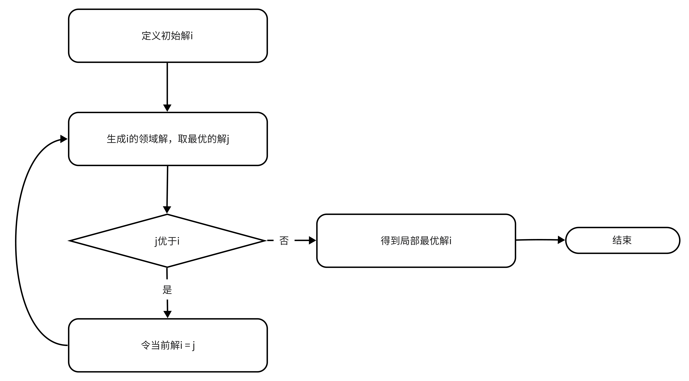
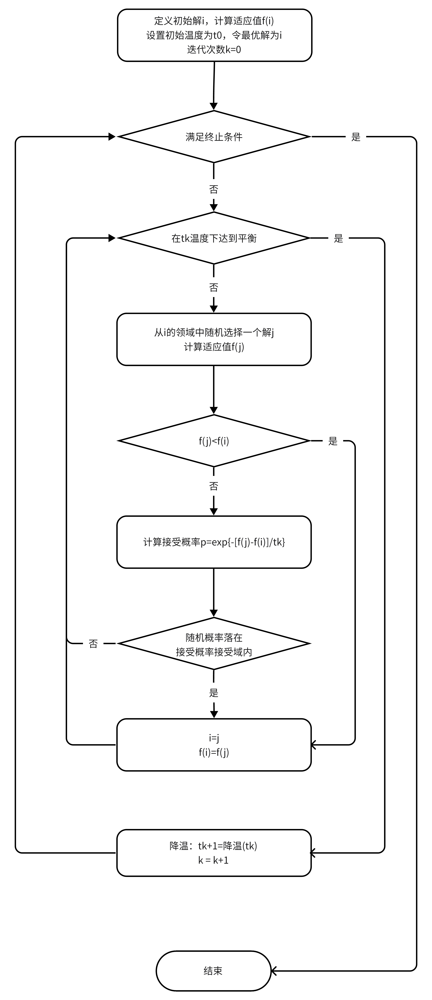
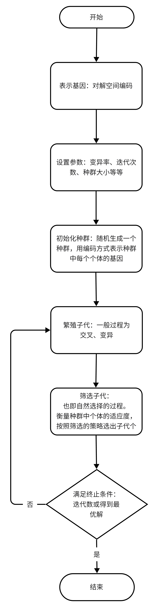
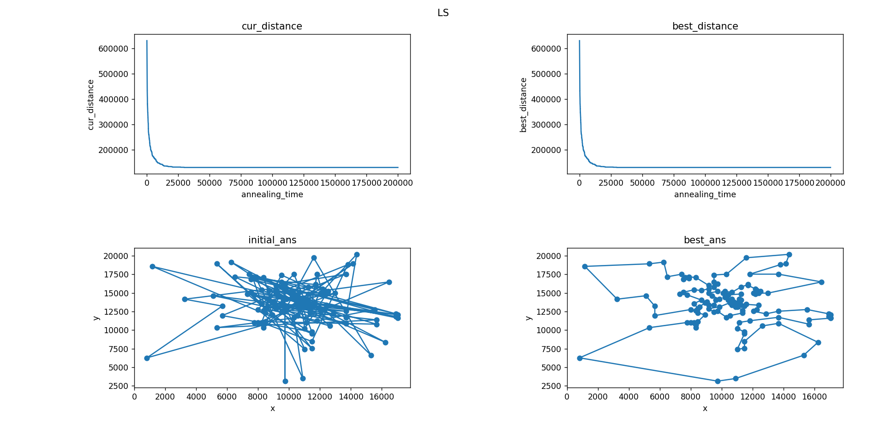
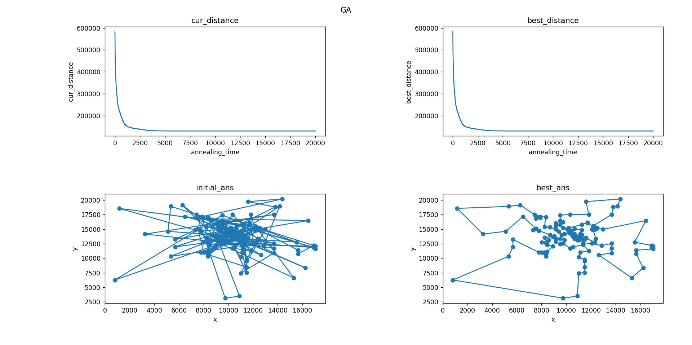
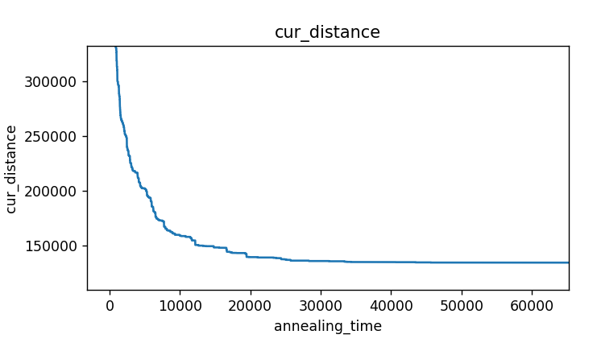
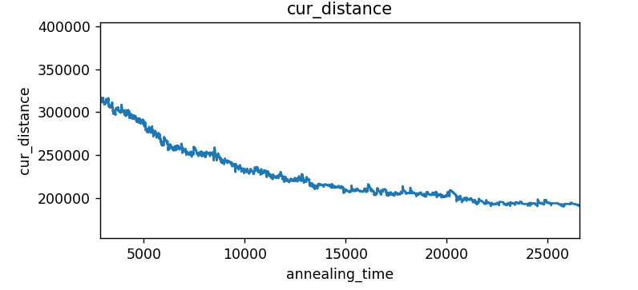

中山大学计算机学院人工智能本科生实验报告

**（2023学年春季学期）**

课程名称：Artificial Intelligence

| 教学班级   | 人工智能         | 专业（方向） | 计算机科学与技术 |
| ------ | ------------ | ------ | -------- |
| **学号** | **21307387** | **姓名** | **陈雪玮**  |

# 一、实验题目

用模拟退火算法和遗传算法求解TSP。

# 二、实验内容

## 1.算法原理

- 爬山算法（局部搜索）
  
  - 该算法又称为局部贪婪搜索，每次从当前解的领域解选择一个最优解作为当前解，直到达到一个局部最优，因此这个算法有可能陷入局部极小和依赖初值。

- 模拟退火算法
  
  - 模拟退火算法是一种优化算法，能够克服优化过程陷入局部极小和克服初值依赖性。模拟退火算法的基本思想出自物理退火过程，在退火过程中热运动趋于稳定，在优化过程中就是解的收敛。通过Metropolis的采样法则，在温度高时接受劣解的可能性更大，温度低时几乎不接受劣解。

- 遗传算法
  
  - 遗传算法受自然界自然选择过程的启发设计。遗传算法的过程是通过对每个世代、多个个体进行编码（模拟遗传基因）、交叉变异、筛选，不断迭代得出下一子代。

## 2.流程图

- 爬山算法（局部搜索）
  
  - 

- 模拟退火算法
  
  - 

- 遗传算法
  
  - 

## 3.关键代码展示（带注释）

选取的数据集是bier127，共127个城市，最优解为118282

- 衡量个体得分（适应度）函数，也即计算总路程，大小越小，则得分越高。以下是模拟退火算法的函数；在遗传算法中，放在个体类Individual中作为成员函数实现，实现方法相同。

```python
# 计算两个城市化之间的欧拉距离
def city_distance(city1, city2):
    return ((city1.x - city2.x) ** 2 + (city1.y - city2.y) ** 2) ** 0.5

# 计算路程
def evaluate(cities):
    distance = 0
    for i in range(len(cities) - 1):
        distance += city_distance(city_list[cities[i]], city_list[cities[i + 1]])
    distance += city_distance(city_list[cities[0]], city_list[cities[-1]])
    return distance


# 定义城市类
class City:
    # 城市序号，横坐标、纵坐标
    def __init__(self, num, x, y):
        self.num = num
        self.x = x
        self.y = y
```

- 爬山算法

```python
    def climb(self):
        for i in range(self.out_iter):
            # while self.T_start >= self.T_end:
            for j in range(self.inn_iter):
                # 随机生成两个点
                idx1 = random.randint(0, self.ans_len - 2)
                idx2 = random.randint(idx1, self.ans_len - 1)
                '''
                # 交换两个点
                new_ans = copy.deepcopy(self.cur_ans)
                new_ans[idx1], new_ans[idx2] = new_ans[idx2], new_ans[idx1]
                new_distance = evaluate(new_ans)
                '''
                # 两个点之间的变成逆序列
                new_ans = copy.deepcopy(self.cur_ans)
                new_ans[idx1:idx2 + 1] = list(reversed(new_ans[idx1:idx2 + 1]))
                new_distance = evaluate(new_ans)

                # 如果新距离比最好的都小，就更新最好的距离，否则把当前解加入集合中
                if new_distance < self.best_distance:
                    self.best_distance = new_distance
                    self.best_ans = new_ans
                    self.best_distance_list.append(self.best_distance)
                else:
                    self.best_distance_list.append(self.best_distance)

                # 与当前解比较，继续探索更好的解决
                if new_distance < self.cur_distance:
                    self.cur_distance = new_distance
                    self.cur_ans = new_ans
                    self.cur_distance_list.append(self.cur_distance)
                else:
                    self.cur_distance_list.append(self.cur_distance)
                '''

            print('温度为:%f , 目前解为:%f , 全局最优解为:%f' % (self.T_start, self.cur_distance, self.best_distance))
```

- 模拟退火

```python
    def anneal(self):
        for i in range(self.out_iter):
            # while self.T_start >= self.T_end:
            for j in range(self.inn_iter):
                # 随机生成两个点
                idx1 = random.randint(0, self.ans_len - 2)
                idx2 = random.randint(idx1, self.ans_len - 1)
                '''
                # 交换两个点
                new_ans = copy.deepcopy(self.cur_ans)
                new_ans[idx1], new_ans[idx2] = new_ans[idx2], new_ans[idx1]
                new_distance = evaluate(new_ans)
                '''
                # 两个点之间的变成逆序列
                new_ans = copy.deepcopy(self.cur_ans)
                new_ans[idx1:idx2 + 1] = list(reversed(new_ans[idx1:idx2 + 1]))
                new_distance = evaluate(new_ans)

                # 如果新距离比最好的都小，就更新最好的距离，否则把当前解加入集合中
                if new_distance < self.best_distance:
                    self.best_distance = new_distance
                    self.best_ans = new_ans
                    self.best_distance_list.append(self.best_distance)
                else:
                    self.best_distance_list.append(self.best_distance)

                # 与当前解比较，继续探索更好的解决
                if new_distance < self.cur_distance:
                    self.cur_distance = new_distance
                    self.cur_ans = new_ans
                    self.cur_distance_list.append(self.cur_distance)
                # 接受概率看是否接受
                else:
                    prob = math.exp(-(math.fabs(new_distance - self.best_distance)) / self.T_start)
                    if random.random() < prob / self.para_y:
                        self.cur_distance = new_distance
                        self.cur_ans = new_ans
                        self.cur_distance_list.append(self.cur_distance)
                    else:
                        self.repeat += 1
                        self.cur_distance_list.append(self.cur_distance)
            # 退火
            self.T_start *= self.alpha
            # 玻尔兹曼退火
            #self.T_start = self.T_high/math.log(1+i+1)

            print('温度为:%f , 目前解为:%f , 全局最优解为:%f' % (self.T_start, self.cur_distance, self.best_distance))
            # 退到最低温，退出循环
            if self.T_start < self.T_end:
                break
```

- 遗传算法

交叉

```python
    def cross(self):
        new_gene = list()
        random.shuffle(self.individual_list) # 打乱种群中的排序，随机交配
        for ind_idx in range(0, len(self.individual_list) - 1, 2): # 两两个体交配
            # 得到两个交配个体的基因编码
            parent_gene1 = copy.deepcopy(self.individual_list[ind_idx].gene_list)
            parent_gene2 = copy.deepcopy(self.individual_list[ind_idx + 1].gene_list)

            # 随机生成两个基因点
            # randint[start,end]
            idx1 = random.randint(0, self.gene_len - 2)
            idx2 = random.randint(idx1, self.gene_len - 1)

            # 得到parent基因的 基因->下标 的字典
            gene_idx1 = {value: idx for idx, value in enumerate(parent_gene1)}
            gene_idx2 = {value: idx for idx, value in enumerate(parent_gene2)}

            # 交叉 方式为在自身的基因内对换，对换的对象用相同位置上另一个亲本的基因来确定，然后在自身寻找这个基因对换
            for i in range(idx1, idx2 + 1):
                if parent_gene1[i] == parent_gene2[i]:
                    continue
                value1, value2 = parent_gene1[i], parent_gene2[i]
                pos1, pos2 = gene_idx1[value2], gene_idx2[value1]
                # 对换基因
                parent_gene1[i], parent_gene1[pos1] = parent_gene1[pos1], parent_gene1[i]
                parent_gene2[i], parent_gene2[pos2] = parent_gene2[pos2], parent_gene2[i]
                # 更新字典
                gene_idx1[value1], gene_idx1[value2] = i, pos1
                gene_idx2[value2], gene_idx2[value1] = i, pos2
            new_gene.append(parent_gene1)
            new_gene.append(parent_gene2)
        return new_gene # 返回交配后的子代
```

变异

```python
    def mutate(self, new_gene):

        '''
        # 随机交换两个基因点
        for gene in new_gene:
            if random.random() <= self.mutate_prob:
                idx1 = random.randint(0, self.gene_len - 2)
                idx2 = random.randint(idx1 + 1, self.gene_len - 1)
                gene[idx1], gene[idx2] = gene[idx2], gene[idx1]
            self.individual_list.append(Individual(gene))
        '''


        # 两个基因点间逆序
        for gene in new_gene:
            if random.random() <= self.mutate_prob:
                idx1 = random.randint(0, self.gene_len - 2)
                idx2 = random.randint(idx1, self.gene_len - 1)
                gene[idx1:idx2 + 1] = list(reversed(gene[idx1:idx2 + 1]))
            self.individual_list.append(Individual(gene))


        '''
        # 两点插入 将随机基因片段插入尾部
        for gene in new_gene:
            if random.random() <= self.mutate_prob:
                idx1 = random.randint(0, self.gene_len - 2)
                idx2 = random.randint(idx1, self.gene_len - 1)
                # idx3 = random.randint(idx2 + 1, self.gene_len - 1)
                t = gene[:idx1]
                t += gene[idx2:]
                t += gene[idx1:idx2]
                gene = t
            self.individual_list.append(Individual(gene))
        '''
        '''
        # 彻底疯狂 完全翻转 随机
        for gene in new_gene:
            if random.random() <= self.mutate_prob:
                # gene = list(reversed(gene))
                random.shuffle(gene)
            self.individual_list.append(Individual(gene))
        '''
```

筛选

```python
    def select(self):
        # 锦标赛筛选法 分小组，选择每个小组里最优秀的前几名个体组成下一代的种群
        group_num = 10  # 小组数
        group_size = 10  # 每小组人数
        group_winner = self.individual_num // group_num  # 每小组筛选出的individual【获胜者】数量
        winners = list()  # 锦标赛结果
        for i in range(group_num):
            group = list()
            for j in range(group_size):
                # 随机组成小组
                player = random.choice(self.individual_list)  # 随机选择参赛者
                group.append(player)
            group = sorted(group)  # 对本次锦标赛获胜者按适应度排序
            # 取出获胜者
            winners += group[:group_winner]
        self.individual_list = winners
```

## 4.创新点&优化（如果有）

- 模拟退火算法产生新解、遗传算法变异的方法使用随机子序列逆转，替代原本的随机两点交换。

- 模拟退火算法接受概率采用阶梯型计算，可以避免过早收敛。这里设计了较为固定的阶梯型来确定接受概率，实际情况可以设计于退火温度或退火次数有关的函数得到更好的结果。

```python
    # -----梯度控制接受概率因子大小，使得函数不那么快收敛
    if self.para_y > 1e-100:
      if self.repeat > self.inn_iter*0.9:
        self.para_y = 1e-80
        self.repeat = 0
      elif self.repeat > self.inn_iter*0.8:
          self.para_y = 1e-40
          self.repeat = 0
      elif self.repeat > self.inn_iter*0.6:
          self.para_y = 1e-20
          self.repeat = 0
      elif self.repeat > self.inn_iter*0.4:
          self.para_y = 1e-10
          self.repeat = 0
      elif self.repeat > self.inn_iter*0.2:
          self.para_y = 1e-5
          self.repeat = 0
      elif self.repeat < self.inn_iter*0.15:
          self.para_y = math.exp(self.T_high/self.T_start)
          self.repeat = 0
      # -----梯度控制接受概率因子大小，使得函数不那么快收敛
```

# 三、实验结果及分析

## 1.实验结果展示示例（可图可表可文字，尽量可视化）

不同算法的路径动态变化动图保存在result文件夹中。

**以下是实验数据结果和静态图片结果。**

运行三次，取结果的平均值作为最终结果。

其中关键参数设置如下：

- 爬山和模拟退火：外循环2000次，循环100次。

- 遗传算法：种群个体数40，迭代次数20000。

|             | LS            | SA            | GA            |
| ----------- | ------------- | ------------- | ------------- |
| **1**       | 137640.975459 | 122672.544008 | 128053.254942 |
| **2**       | 130424.165656 | 121321.562715 | 129610.838522 |
| **3**       | 127666.625615 | 122801.801097 | 129845.082181 |
| **average** | 131910.588910 | 122265.302607 | 129169.725215 |

某一次运行结果的图片如下：

- LS



- SA


- GA



**优化前后结果**

- 采用不同变异（产生新解）方式的结果对比

| 最优距离 | 随机交换两点        | 随机一个片段逆序      |
| ---- | ------------- | ------------- |
| LS   | 168364.878912 | 131910.588910 |
| SA   | 157140.488677 | 122265.302607 |
| GA   | 184487.005442 | 129169.725215 |

## 2.评测指标展示及分析（机器学习实验必须有此项，其它可分析运行时间等）

最优解为118282，三种算法求得的最好解误差都在10%以内。

- 模拟退火

通过结果和图片对比分析可知，局部搜索策略易于陷入极小值，模拟退火算法则优化了这一问题，陷入极小值后仍有可能跳出。

局部搜索算法的当前解就是最优解，变化是单调不递增的；模拟退火算法的当前解允许出现波动，接受劣解，而最优解是单调不递增的，当前解与最优解的整体趋势相同。

LS：



SA：



- 遗传算法

采用相同的局部搜索策略，遗传算法的效果不如模拟退火算法优秀。

遗传算法要得到更好的结果，在变异概率、种群的大小、迭代次数、交叉变异操作、精英策略、避免陷入局部等方面需要多下功夫。种群过大不利于收敛，种群太小趋近于单点搜索，可以考虑随着种群的迭代数增多，种群的数量减少，使得在开始时种群多样性更高，收敛时得到的是更好的精英。

- 单点搜索与多点搜索优缺点比较

|     | 单点搜索         | 多点搜索                     |
| --- | ------------ | ------------------------ |
| 优点  | 速度快、易收敛、实现简单 | 模拟自然规律，直观上更可信，能更好避免局部最优解 |
| 缺点  | 容易陷入局部最优解    | 速度慢、实现复杂、鲁棒性不足、较难收敛      |

- 优化前后结果分析

优化后的局部搜索策略得到的结果明显优于优化前。从优化方法本身分析，随即交换两个点随机性较弱，容易陷入局部最优，导致过早收敛；而对序列中一个片段逆序则大大增加了随机性，能在保持原有求解方向的基础上又不至于过快收敛，因此能得到更好的结果。

**|-----------如有优化，请重复1，2，分析优化后的算法结果-----------------------|**

# 四、思考题

无

# 五、参考资料

实验课件
