中山大学计算机学院人工智能本科生实验报告

**（2023学年春季学期）**

课程名称：Artificial Intelligence

| 教学班级   | 人工智能         | 专业（方向） | 计算机科学与技术 |
| ------ | ------------ | ------ | -------- |
| **学号** | **21307387** | **姓名** | **陈雪玮**  |

# 一、实验题目

人工神经网络与梯度下降

# 二、实验内容

## 1.算法原理

- 人工神经网络（Artificial Neural Network，ANN）是一种模拟生物神经系统结构和功能的计算模型。它由许多相互连接的节点（也称为神经元）组成，这些节点将输入信号转换为输出信号，并通过这些信号来进行学习和预测。
  
  人工神经网络一般抽象为输入层、隐藏层、输出层，隐藏层又由仿射层和激活层构成。层与层之间的数据传输使用矩阵运算实现。numpy可以高效进行矩阵运算。

- 梯度下降算法是一种优化算法，它的目标是最小化一个损失函数的值。在神经网络中，损失函数通常衡量了模型对于给定输入数据的预测结果与真实结果之间的差距，因此我们希望通过优化损失函数来提高模型的准确性。使用误差反向传播方法可以高效地得到每一层权重矩阵地梯度，使得学习可以快速进行。

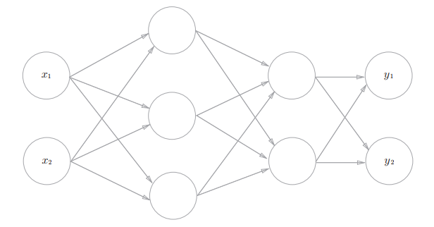

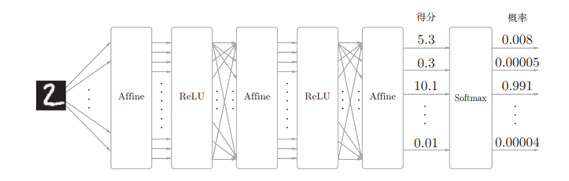

## 2.流程图

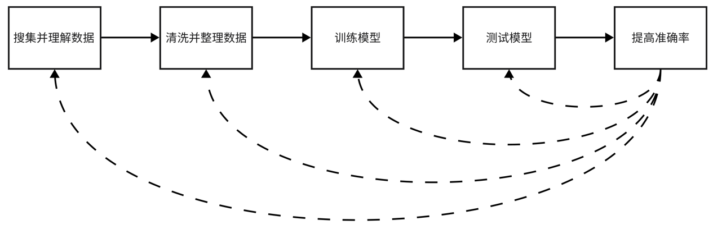

## 3.实验过程（关键代码展示）

代码参考书籍《深度学习入门：基于Python的理论与实现》,使用书中部分代码.

### 1.搜集并理解数据

每一个数据如下，第一列是序号，第二列是标签号，第三列是字符标签，后面的是词语。

我们要做的就是预测给出的句子属于哪个标签号，与教师标签比较得到准确率。

训练集共246个数据，测试集共1000个数据。

```textile
247 4 joy test to predict breast cancer relaps is approv
```

### 2.读取数据

**读取数据代码在`encode.py`中.**

数据中有很多词语与情感表示无关,因此可以使用停用词表来将部分词筛选出去.

下面是tf_idf的实现.

```python
def tf_idf(word, doc, docs):
    # word是要计算的单词，doc是当前文档存有所有单词，docs是所有的文档
    word_doc = sum(1 for doc in docs if word in docs)  # 计算所有文档中包含该单词的文档数
    tf = doc.count(word) / len(doc)
    idf = np.log(len(docs) / (word_doc + 1))
    return tf * idf
```

### 3.搭建网络

模型使用一个隐藏层的全连接神经网络,误差导数使用反向传播算法.网络仅设置一个隐藏层,结点数为100.

**网络类在`network.net`中**,

```python
class Network:
    def __init__(self, input_size, hidden_size_list, output_size,
                 activation, weight_init_std, weight_decay_lambda,
                 use_dropout, dropout_ration, use_batchnorm):
        self.input_size = input_size
        self.hidden_size_list = hidden_size_list
        self.output_size = output_size

        self.hidden_layer_num = len(hidden_size_list)
        self.use_dropout = use_dropout
        self.weight_decay_lambda = weight_decay_lambda
        self.use_batchnorm = use_batchnorm
        self.params = {}  # 不同层的字典

        self.dropout_ration = dropout_ration
        self.activation = activation
        self.weight_init_std = weight_init_std
        # 初始化权重
        self.__init_weight(weight_init_std)

        # 生成层
        activation_layer = {'sigmoid': Sigmoid, 'relu': Relu}
        self.layers = OrderedDict()  # 顺序排列每一层的字典
        for idx in range(1, self.hidden_layer_num + 1):  # 层的下标从1开始索引
            self.layers['Affine' + str(idx)] = Affine(self.params['W' + str(idx)], self.params['b' + str(idx)])
            # 标准化，Affine层后加入标准化层是数据标准化后再传输给激活层
            if self.use_batchnorm:
                self.params['gamma' + str(idx)] = np.ones(hidden_size_list[idx - 1])
                self.params['beta' + str(idx)] = np.zeros(hidden_size_list[idx - 1])
                self.layers['BatchNorm' + str(idx)] = BatchNormalization(self.params['gamma' + str(idx)],
                                                                         self.params['beta' + str(idx)])
            # 激活层
            self.layers['Activati on_function' + str(idx)] = activation_layer[activation]()

            # dropout，在下一个Affine层之前删除一定数量的神经元输出
            if self.use_dropout:
                self.layers['Dropout' + str(idx)] = Dropout(dropout_ration)

        # 最后一层是损失函数层
        idx = self.hidden_layer_num + 1
        self.layers['Affine' + str(idx)] = Affine(self.params['W' + str(idx)], self.params['b' + str(idx)])
        self.last_layer = SoftmaxWithLoss()

    def __init_weight(self, weight_init_std):
        """设定权重的初始值

        Parameters
        ----------
        weight_init_std : 指定权重的标准差（e.g. 0.01）
            指定'relu'或'he'的情况下设定“He的初始值”
            指定'sigmoid'或'xavier'的情况下设定“Xavier的初始值”
        """
        all_size_list = [self.input_size] + self.hidden_size_list + [self.output_size]
        for idx in range(1, len(all_size_list)):
            scale = weight_init_std
            if str(weight_init_std).lower() in ('relu', 'he'):
                scale = np.sqrt(2.0 / all_size_list[idx - 1])  # 使用ReLU的情况下推荐的初始值 前一层节点数/2开方
            elif str(weight_init_std).lower() in ('sigmoid', 'xavier'):
                scale = np.sqrt(1.0 / all_size_list[idx - 1])  # 使用sigmoid的情况下推荐的初始值
            self.params['W' + str(idx)] = scale * np.random.randn(all_size_list[idx - 1], all_size_list[idx])
            self.params['b' + str(idx)] = np.zeros(all_size_list[idx])

    def predict(self, x, train_flg=False):
        for key, layer in self.layers.items():
            # 只有在dropout和batchnorm时候需要在训练和测试时有所区分
            if "Dropout" in key or "BatchNorm" in key:
                x = layer.forward(x, train_flg)
            else:
                x = layer.forward(x)

        return x

    def loss(self, x, t, train_flg=False):
        """求损失函数
        参数x是输入数据，t是教师标签
        """
        y = self.predict(x, train_flg)

        weight_decay = 0
        for idx in range(1, self.hidden_layer_num + 2):
            W = self.params['W' + str(idx)]
            weight_decay += 0.5 * self.weight_decay_lambda * np.sum(W ** 2)

        return self.last_layer.forward(y, t) + weight_decay

    # 测试准确率 X是测试标签 T是教师标签
    def accuracy(self, X, T):
        Y = np.argmax(self.predict(X, train_flg=False),axis=1)
        T = np.argmax(T, axis=1)
        accuracy = np.sum(Y == T) / float(X.shape[0])
        return accuracy

    def numerical_gradient(self, X, T):
        """求梯度（数值微分）

        Parameters
        ----------
        X : 输入数据
        T : 教师标签

        Returns
        -------
        具有各层的梯度的字典变量
            grads['W1']、grads['W2']、...是各层的权重
            grads['b1']、grads['b2']、...是各层的偏置
        """
        loss_W = lambda W: self.loss(X, T, train_flg=True)

        grads = {}
        for idx in range(1, self.hidden_layer_num + 2):
            grads['W' + str(idx)] = numerical_gradient(loss_W, self.params['W' + str(idx)])
            grads['b' + str(idx)] = numerical_gradient(loss_W, self.params['b' + str(idx)])

            if self.use_batchnorm and idx != self.hidden_layer_num + 1:
                grads['gamma' + str(idx)] = numerical_gradient(loss_W, self.params['gamma' + str(idx)])
                grads['beta' + str(idx)] = numerical_gradient(loss_W, self.params['beta' + str(idx)])

        return grads

    # 误差反向传播求导
    def bp_gradient(self, x, t):
        # forward 给出损失函数值
        y = self.loss(x, t, train_flg=True)

        # backward
        dout = y
        dout = self.last_layer.backward(dout)
        # 将所有层逆序排列 逐层反向传播
        layers = list(self.layers.values())
        layers.reverse()
        for layer in layers:
            dout = layer.backward(dout)

        # 设定
        grads = {}
        for idx in range(1, self.hidden_layer_num + 2):
            grads['W' + str(idx)] = self.layers['Affine' + str(idx)].dW + self.weight_decay_lambda * self.params['W' + str(idx)]
            grads['b' + str(idx)] = self.layers['Affine' + str(idx)].db

            if self.use_batchnorm and idx != self.hidden_layer_num + 1:
                grads['gamma' + str(idx)] = self.layers['BatchNorm' + str(idx)].dgamma
                grads['beta' + str(idx)] = self.layers['BatchNorm' + str(idx)].dbeta

        return grads
```

**每一层的的实现在`layer.py`中**.基础是Affine层,激活函数层(Relu和Sigmoid),最后一层(输出损失函数值),抑制过拟合有效的层位标准化层和dropout层.

```python
# 标准化层
class BatchNormalization:
    def __init__(self, gamma, beta, momentum=0.9, running_mean=None, running_var=None):
        self.gamma = gamma
        self.beta = beta
        self.momentum = momentum
        self.input_shape = None  # Conv层的情况下为4维，全连接层的情况下为2维

        # 测试时使用的平均值和方差
        self.running_mean = running_mean
        self.running_var = running_var

        # backward时使用的中间数据
        self.batch_size = None
        self.xc = None
        self.std = None
        self.dgamma = None
        self.dbeta = None

    def forward(self, x, train_flg=True):
        self.input_shape = x.shape
        out = self.__forward(x, train_flg)

        return out.reshape(*self.input_shape)

    def __forward(self, x, train_flg):
        if self.running_mean is None:
            N, D = x.shape
            self.running_mean = np.zeros(D)
            self.running_var = np.zeros(D)

        if train_flg:
            mu = x.mean(axis=0)
            xc = x - mu
            var = np.mean(xc ** 2, axis=0)
            std = np.sqrt(var + 10e-7)
            xn = xc / std

            self.batch_size = x.shape[0]
            self.xc = xc
            self.xn = xn
            self.std = std
            self.running_mean = self.momentum * self.running_mean + (1 - self.momentum) * mu
            self.running_var = self.momentum * self.running_var + (1 - self.momentum) * var
        else:
            xc = x - self.running_mean
            xn = xc / ((np.sqrt(self.running_var + 10e-7)))

        out = self.gamma * xn + self.beta
        return out

    def backward(self, dout):
        if dout.ndim != 2:
            N, C, H, W = dout.shape
            dout = dout.reshape(N, -1)

        dx = self.__backward(dout)

        dx = dx.reshape(*self.input_shape)
        return dx

    def __backward(self, dout):
        dbeta = dout.sum(axis=0)
        dgamma = np.sum(self.xn * dout, axis=0)
        dxn = self.gamma * dout
        dxc = dxn / self.std
        dstd = -np.sum((dxn * self.xc) / (self.std * self.std), axis=0)
        dvar = 0.5 * dstd / self.std
        dxc += (2.0 / self.batch_size) * self.xc * dvar
        dmu = np.sum(dxc, axis=0)
        dx = dxc - dmu / self.batch_size

        self.dgamma = dgamma
        self.dbeta = dbeta

        return dx


# 激活层Relu
class Relu:
    def __init__(self):
        self.mask = None  # 把正向传播时的输入 x的元素中小于等于0的地方保存为 True，其他地方（大于0的元素）保存为 False。

    def forward(self, x):  # 输入的是numpy数组
        self.mask = (x <= 0)
        out = x.copy()
        out[self.mask] = 0
        return out

    def backward(self, dout):
        dout[self.mask] = 0
        dx = dout
        return dx


# sigmoid 激活函数层
class Sigmoid:
    def __init__(self):
        self.out = None

    def forward(self, x):
        out = 1 / (1 + np.exp(-x))
        self.out = out
        return out

    def backward(self, dout):
        dx = dout * (1.0 - self.out) * self.out
        return dx


# 仿射层
class Affine:
    def __init__(self, W, b):
        self.W = W
        self.b = b
        self.x = None
        self.dW = None
        self.db = None

    def forward(self, x):
        self.x = x
        out = np.dot(x, self.W) + self.b
        return out

    def backward(self, dout):
        dx = np.dot(dout, self.W.T)
        self.dW = np.dot(self.x.T, dout)
        self.db = np.sum(dout, axis=0)
        return dx


# 损失函数层 最后一层
class SoftmaxWithLoss:
    def __init__(self):
        self.loss = None
        self.y = None
        self.t = None

    def forward(self, x, t):
        self.t = t
        self.y = softmax(x)
        self.loss = cross_entropy_error(self.y, self.t)
        return self.loss

    def backward(self, dout=1):
        batch_size = self.t.shape[0]
        dx = (self.y - self.t) / batch_size
        # print('this is loss backward,next is affine\n', np.average(dx,axis=0))
        return dx


# dropout方法
class Dropout:
    def __init__(self, dropout_ratio):
        self.dropout_ratio = dropout_ratio
        self.mask = None

    def forward(self, x, train_flg=True):
        if train_flg:  # 训练的时候随机删除神经元
            self.mask = np.random.rand(*x.shape) > self.dropout_ratio
            return x * self.mask
        else:  # 测试的时候乘上删除比例，实质上就是模拟集成神经网络学习
            return x * (1.0 - self.dropout_ratio)

    def backward(self, dout):
        return dout * self.mask
```

**函数实现在`function.py`中.**

```python
import numpy as np


def step_function(x):
    y = x > 0
    return y.astype(np.int32)  # 支持numpy向量运算


def sigmoid(x):
    return 1 / (1 + np.exp(-x))


def relu(x):
    return np.maximum(0, x)


def identity_function(x):
    return x


def softmax(a):
    # -----可能会溢出-----
    # exp_a = np.exp(a)
    # sum_exp_a = np.sum(exp_a)
    # y = exp_a / sum_exp_a
    # -----溢出对策-----可以证明与原式得出的结果一模一样
    exp_a = np.exp(a - np.max(a))
    sum_exp_a = np.sum(exp_a)
    y = exp_a / sum_exp_a
    return y


# 均方误差函数
def mean_square_error(y, t):
    if y.ndim == 1:
        t = t.reshape(1, t.size)
        y = y.reshape(1, y.size)
    batch_size = y.shape[0]
    return 0.5 * np.sum((y - t) ** 2) / batch_size


# 交叉熵误差函数
def cross_entropy_error(y, t):
    if y.ndim == 1:
        t = t.reshape(1, t.size)
        y = y.reshape(1, y.size)
    batch_size = y.shape[0]
    delta = 1e-7  # 保护措施
    return -np.sum(t * np.log(y + delta)) / batch_size
```

**梯度更新的方法在`optimizer.py`中**.主要使用SGD和Adagrad方法.

```python
class SGD:
    def __init__(self, lr=0.01):
        self.lr = lr

    def update(self, params, grads):
        for key in params.keys():
            params[key] -= self.lr * grads[key]

class AdaGrad:
    def __init__(self, lr=0.01):
        """
        构造函数，初始化 AdaGrad 参数

        :param lr: 学习率（Learning Rate），默认为 0.01
        """
        self.lr = lr
        self.h = None  # 保存以前所有梯度值的平方和

    def update(self, params, grads):
        """
        更新参数

        :param params: 需要更新的参数
        :param grads: 模型计算出的梯度
        """
        if self.h is None:
            # 如果还没有记录过前面的梯度平方和，则初始化
            self.h = {}
            for key, val in params.items():
                self.h[key] = np.zeros_like(val)
        else:
            # 如果已经有了前面的梯度平方和，则累加当前梯度平方和
            for key in params.keys():
                # 更新梯度平方和
                self.h[key] += grads[key] * grads[key]

                # 计算学习率，这里使用 AdaGrad 的自适应学习率方法
                lr = self.lr / (np.sqrt(self.h[key]) + 1e-7)

                # 更新参数
                params[key] -= lr * grads[key]
```

### 4.训练和测试模型

使用类`Train`进行模型的训练和测试.代码在`train.py`中.

```python
class Train:
    def __init__(self, network, x_train, t_train, x_test, t_test,
                 epochs, mini_batch_size,
                 optimizer, optimizer_lr, evaluate_sample_num_per_epoch):
        self.network = network
        self.x_train = x_train
        self.t_train = t_train
        self.x_test = x_test
        self.t_test = t_test
        self.epochs = epochs  # 多少个epochs 一个epochs当作一次输出
        self.batch_size = mini_batch_size  # 一个mini_batch大小
        self.evaluate_sample_num_per_epoch = evaluate_sample_num_per_epoch  # 小样本 用于快速评估网络性能
        self.optimizer_lr = optimizer_lr
        # 寻找最小梯度的方法
        optimizer_class_dict = {'sgd': SGD, 'momentum': Momentum,
                                'adagrad': AdaGrad}
        # optimizer_param是传入参数
        self.str_optimizer = optimizer
        self.optimizer = optimizer_class_dict[optimizer.lower()](lr=optimizer_lr)
        # 训练集大小
        self.train_size = x_train.shape[0]
        # 每个epoch有几个循环 epoch = train_size // mini_batch_size
        # 我们有246个训练样本 mini_batch_size设置为246 即一次循环一个epochs
        self.iter_per_epoch = max(self.train_size // mini_batch_size, 1)
        # 总的循环次数
        self.all_iter = int(self.epochs * self.iter_per_epoch)
        self.current_iter = 0
        self.current_epoch = 0

        self.train_loss_list = []
        self.train_acc_list = []
        self.test_acc_list = []

    def train_step(self):
        # 所有样本中随机抽取batch_size个样本量
        batch_mask = np.random.choice(self.train_size, self.batch_size)
        x_batch = self.x_train[batch_mask]
        t_batch = self.t_train[batch_mask]
        # 获取梯度并学习
        grads = self.network.bp_gradient(x_batch, t_batch)
        self.optimizer.update(self.network.params, grads)

        # 获得损失函数
        loss = self.network.loss(x_batch, t_batch)
        self.train_loss_list.append(loss)
        print("train loss:" + str(loss))

        # 每个epoch评估一次
        if self.current_iter % self.iter_per_epoch == 0:
            self.current_epoch += 1

            # 对网络性能进行快速评估 否则就是使用全部样本进行评估
            if not self.evaluate_sample_num_per_epoch is None:
                t = self.evaluate_sample_num_per_epoch
                x_train_sample, t_train_sample = self.x_train[:t], self.t_train[:t]
                x_test_sample, t_test_sample = self.x_test[:t], self.t_test[:t]
            else:
                x_train_sample, t_train_sample = self.x_train, self.t_train
                x_test_sample, t_test_sample = self.x_test, self.t_test
            # 计算准确率
            train_acc = self.network.accuracy(x_train_sample, t_train_sample)
            test_acc = self.network.accuracy(x_test_sample, t_test_sample)
            self.train_acc_list.append(train_acc)
            self.test_acc_list.append(test_acc)

            print(
                "=== epoch:" + str(self.current_epoch) + ", train acc:" + str(train_acc) + ", test acc:" + str(
                    test_acc) + " ===")
        self.current_iter += 1

    # 训练并测试准确率
    def train(self):
        for i in range(self.all_iter):
            self.train_step()
        test_acc = self.network.accuracy(self.x_test, self.t_test)
        print("=============== Final Test Accuracy ===============")
        print("test acc:" + str(test_acc))
        return test_acc

    def draw_acc_loss(self):
        epochs = np.arange(0, self.current_epoch)
        iters = np.arange(0, self.all_iter)
        fig, axes = plt.subplots(1, 2, figsize=(10, 6))

        axes[0].plot(iters, self.train_loss_list)
        axes[0].set_xlabel('iter'), axes[0].set_ylabel('train loss'), axes[0].set_title('loss')
        axes[0].legend(['loss'])

        axes[1].plot(epochs, self.train_acc_list)
        axes[1].plot(epochs, self.test_acc_list)
        axes[1].set_xlabel('epoch'), axes[1].set_ylabel('accuracy'), axes[1].set_title('accuracy')
        axes[1].legend(['train acc', 'test acc'])
        plt.savefig('./result/acc_loss', bbox_inches='tight', dpi=600)
        plt.show()
```

在`setup.py`中启动函数.步骤如下:

1. 读取数据,词向量表示法可以选择one_hot,tf_idf.可以选择是否启用禁用词表.

2. 创建网络.设置网络参数,可以选择是否使用dropout,batchnormalize,选择激活函数和调整其它参数.

3. 训练网络.将以上创建好的网络传入训练类中,对其训练.可以选择minibatch大小和epochs控制训练次数和每次训练样本大小.可以设置学习率.

4. 测试准确率并绘图.训练结束后将测试最终测试准确率,然后绘制有关损失函数,训练过程准确率变化的图像,并保存到result文件夹中.

5. 优化.测试不同的参数,使用Find类每次在一定范围内进行多个批次学习,并绘制参数变化与最终准确率的图像,保存在result文件夹中.

6. 确定较优网络.

```python
# 读取数据
x_train, t_train, t2_train = read_file('./dataset/Classification/train.txt')
x_test, t_test, t2_test = read_file('./dataset/Classification/test.txt')
# 开启禁用词 用什么方式转换词
ban = True
function = 'one_hot'
x_train, t_train, x_test, t_test = word2vec(x_train=x_train, t_train=t_train, x_test=x_test, t_test=t_test,
                                            ban=ban, function=function)
# 转换成numpy数组
x_train, t_train, x_test, t_test = np.array(x_train), np.array(t_train), np.array(x_test), np.array(t_test)
# ----------------------------------------------------------
# 网络矩阵大小
input_size = len(x_train[0])
hidden_size_list = [100]
output_size = len(t_train[0])
# 其它参数
use_dropout = True  # dropout 方法
use_batchnorm = True  # 标准化
activation = 'relu'  # 激活函数
weight_init_std = activation  # 初始权值
weight_decay_lambda = 0.6  # 权值衰减系数
dropout_ration = 0.8  # dropout比例
# 创建网络
network = Network(input_size=input_size, hidden_size_list=hidden_size_list, output_size=output_size,
                  activation=activation, weight_init_std=weight_init_std, weight_decay_lambda=weight_decay_lambda,
                  use_dropout=use_dropout, dropout_ration=dropout_ration, use_batchnorm=use_batchnorm)
# -------------------------------------------------------------------
# 训练参数
epochs = 50
mini_batch_size = 40  # 100个 共246个数据 一个epochs会有两次循环 设置epochs为250 总共循环次数为500
optimizer = 'Adagrad'
optimizer_lr = 0.01
evaluate_sample_num_per_epoch = None
# 训练并绘制损失函数和正确率的变化图
train = Train(network=network, x_train=x_train, t_train=t_train, x_test=x_test, t_test=t_test,
              epochs=epochs, mini_batch_size=mini_batch_size,
              optimizer=optimizer, optimizer_lr=optimizer_lr,
              evaluate_sample_num_per_epoch=evaluate_sample_num_per_epoch)
# 训练结束 测试准确率
test_acc = train.train()
# 得到训练过程准确率 和 损失函数值的变化 绘图
train.draw_acc_loss()
# -----------------------------------------------------------------------
# 使用验证集调整超参数，寻找更优超参数
#find = Find(network, train, x_train, t_train)
# find.find_lr(0.00006,0.000,0.00001)
# find.find_dropout_ration(0.1,0.5,0.01)
# find.find_weight_decay_lambda(0.1,0.5,0.02)
'''
经过反复测试 得到较好的参数为
lr = 
dropout_ration = 
decay_lambda = 
'''
```

### 5.提高准确率（创新点&优化）

本实验测试集1000个,训练集只有246个,过拟合现象严重.因此需要使用一些方法来抑制过拟合,使得学习可以正确进行,但也要防止梯度爆炸和梯度消失的问题,以期望最终准确率可以达到35%-45%.下面是使用的一些优化方法.

- 启用停用词表.

- 使用relu激活函数.

- 权值初始化指定'relu'设定“He的初始值”,'sigmoid设定“Xavier的初始值”.

- 使用标准化方法.

- 使用dropout方法.

- 使用类`Find`来寻找更优的参数.这里调整的参数有学习率,权值衰减系数,dropout比例.

Find类代码在`train.py`中,如下.

```python
class Find:
    def __init__(self, network, train, x_train, t_train):
        # 打乱训练数据
        x_train, t_train = self.shuffle_dataset(x_train, t_train)
        # 取部分数据作为验证集
        validation_rate = 1
        validation_num = int(x_train.shape[0] * validation_rate)
        self.x_val = x_train[:validation_num]
        self.t_val = t_train[:validation_num]
        self.network = network
        self.train = train

    def draw_acc(self, x, y, x_label, y_label, title):
        plt.plot(x, y)
        plt.xlabel(x_label)
        plt.ylabel(y_label)
        plt.title(title)
        plt.savefig('./result/' + title + '.png', dpi=600)
        plt.show()

    def find_lr(self, start, end, distance):
        # 创建不同学习率的多个训练方法
        # 根据给定创建范围数组
        x_list = np.arange(start, end, distance)  # lr
        y_list = []
        for x in x_list:
            train = Train(network=self.train.network, x_train=self.x_val, t_train=self.t_val,
                          x_test=self.train.x_test, t_test=self.train.t_test,
                          epochs=self.train.epochs, mini_batch_size=self.train.batch_size,
                          optimizer=self.train.str_optimizer, optimizer_lr=x,  # 这是变量
                          evaluate_sample_num_per_epoch=self.train.evaluate_sample_num_per_epoch)
            test_acc = train.train()
            y_list.append(test_acc)
        self.draw_acc(x_list, y_list, 'lr', 'acc', 'lr_acc')

    def find_weight_decay_lambda(self, start, end, distance):
        x_list = np.arange(start, end, distance)
        y_list = []
        for x in x_list:  # weight_decay_lambda
            network = Network(input_size=self.network.input_size, hidden_size_list=self.network.hidden_size_list,
                              output_size=self.network.output_size,
                              activation=self.network.activation, weight_init_std=self.network.weight_init_std,
                              weight_decay_lambda=x,  # 这是变量
                              use_dropout=self.network.use_dropout, dropout_ration=self.network.dropout_ration,
                              use_batchnorm=self.network.use_batchnorm)
            train = Train(network=network, x_train=self.x_val, t_train=self.t_val,
                          x_test=self.train.x_test, t_test=self.train.t_test,
                          epochs=self.train.epochs, mini_batch_size=self.train.batch_size,
                          optimizer=self.train.str_optimizer, optimizer_lr=self.train.optimizer_lr,
                          evaluate_sample_num_per_epoch=self.train.evaluate_sample_num_per_epoch)
            test_acc = train.train()
            y_list.append(test_acc)
        self.draw_acc(x_list, y_list, 'weight_decay_lambda', 'acc', 'weight_decay_lambda_acc')

    def find_dropout_ration(self, start, end, distance):
        x_list = np.arange(start, end, distance)
        y_list = []
        for x in x_list:  # dropout_ration
            network = Network(input_size=self.network.input_size, hidden_size_list=self.network.hidden_size_list,
                              output_size=self.network.output_size,
                              activation=self.network.activation, weight_init_std=self.network.weight_init_std,
                              weight_decay_lambda=self.network.weight_decay_lambda,
                              use_dropout=self.network.use_dropout, dropout_ration=x,  # 这是变量
                              use_batchnorm=self.network.use_batchnorm)
            train = Train(network=network, x_train=self.x_val, t_train=self.t_val,
                          x_test=self.train.x_test, t_test=self.train.t_test,
                          epochs=self.train.epochs, mini_batch_size=self.train.batch_size,
                          optimizer=self.train.str_optimizer, optimizer_lr=self.train.optimizer_lr,
                          evaluate_sample_num_per_epoch=self.train.evaluate_sample_num_per_epoch)
            test_acc = train.train()
            y_list.append(test_acc)
        print(x_list,y_list)
        self.draw_acc(x_list, y_list, 'dropout_ration', 'acc', 'dropout_ration_acc')

    def shuffle_dataset(self, x, t):
        """打乱数据集

        Parameters
        ----------
        x : 训练数据
        t : 监督数据

        Returns
        -------
        x, t : 打乱的训练数据和监督数据
        """
        permutation = np.random.permutation(x.shape[0])
        x = x[permutation, :] if x.ndim == 2 else x[permutation, :, :, :]
        t = t[permutation]

        return x, t
```

# 三、实验结果及分析

## 1.实验结果展示示例（可图可表可文字，尽量可视化）

参数如下,得到如图的结果.

```python
# 读取文件方式
ban = True
function = 'one_ho
# 网络矩阵大小
input_size = len(x_train[0])
hidden_size_list = [100]
output_size = len(t_train[0])
# 网络参数
use_dropout = True  # dropout 方法
use_batchnorm = True  # 标准化
activation = 'relu'  # 激活函数
weight_init_std = activation  # 初始权值
weight_decay_lambda = 0.6  # 权值衰减系数
dropout_ration = 0.8  # dropout比例
# 训练参数
epochs = 50
mini_batch_size = 40  # 100个 共246个数据 一个epochs会有两次循环 设置epochs为250 总共循环次数为500
optimizer = 'Adagrad'
optimizer_lr = 0.01
evaluate_sample_num_per_epoch = None
```


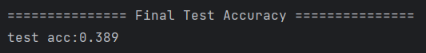

以下是对不同学习率测试的准确率变化图像.范围是(0.005,0.02,0.001).

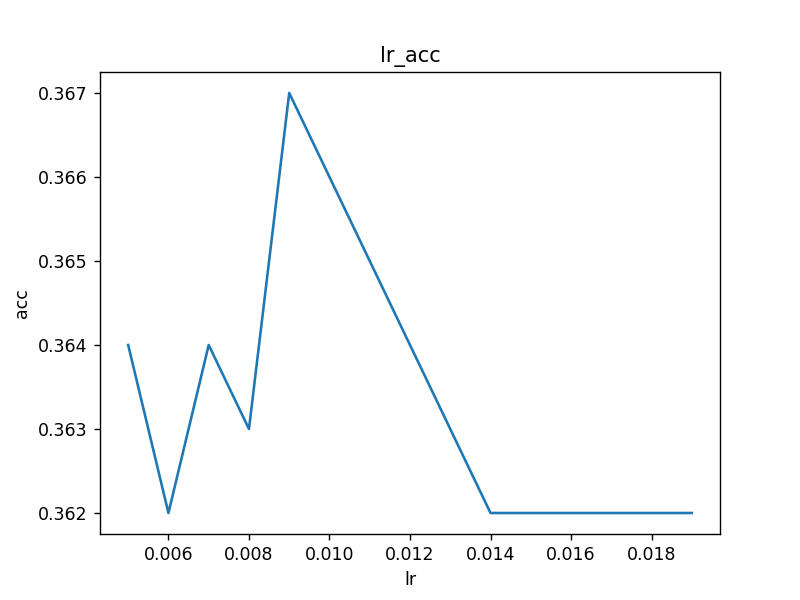

我们缩小范围,再寻找一次.设置范围(0.008,0.015,0.001).得到下图.

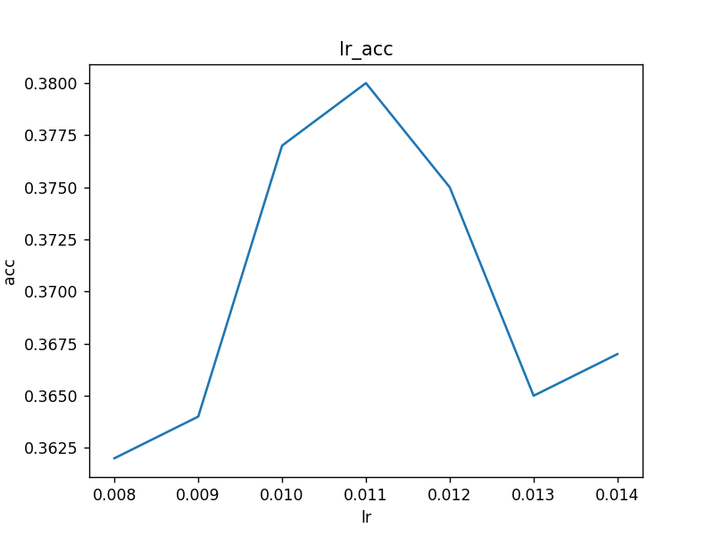

我们确定最优的学习率在0.010-0.013之间.选择0.011作为学习率.

---  

类似的,我们寻找dropout比例和权值衰减的更优参数.

下面是dropout比例,范围在(0.4,1,0.1)

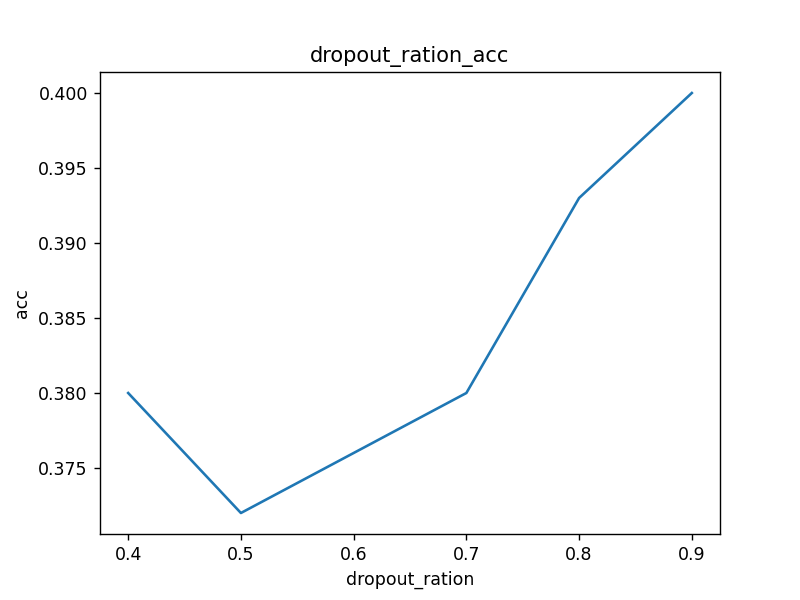

我们缩小范围(0.8,0.89,0.01),再次测试如下

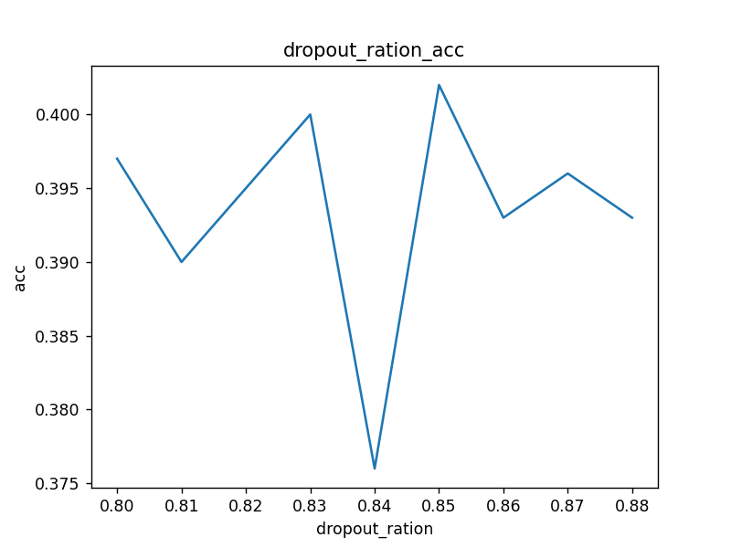

经过对上面几个较优值测试,最终选择dropout比例为0.8.

---

类似的,我们寻找dropout比例和权值衰减的更优参数.范围在(0.1,1.1,0.1)

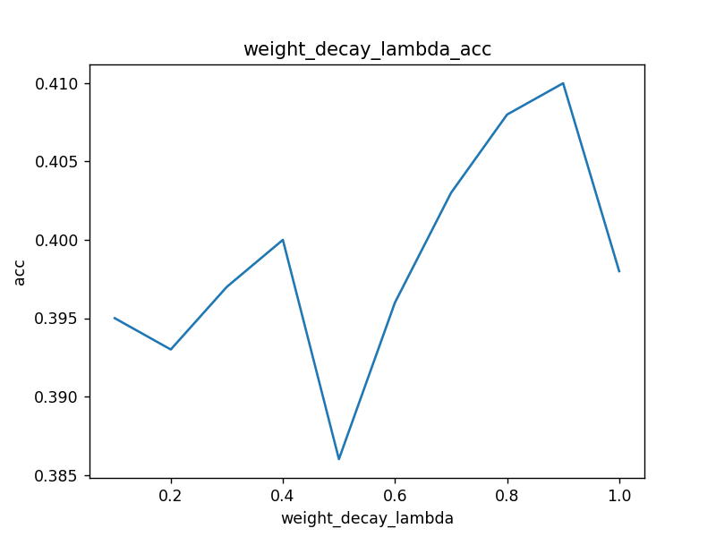

我们缩小范围(0.7,0.9,0.01),再次测试如下.

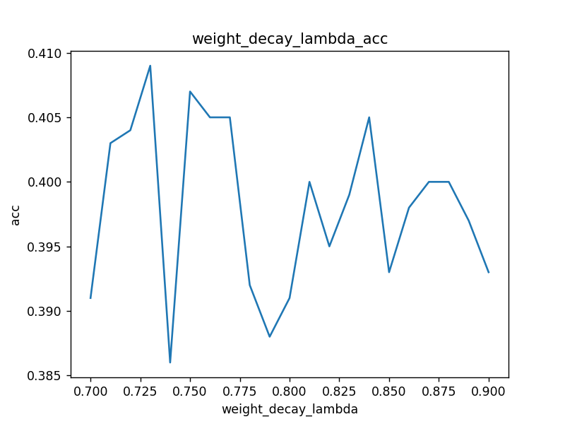

经过对上面几个较优值测试,最终选择权值衰减比例为0.823.

最终得到最高准确率为0.411,一般准确率在0.39-0.41左右波动.

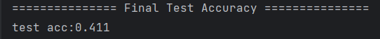

---

## 2.评测指标展示及分析（机器学习实验必须有此项，其它可分析运行时间等）

以下测试了不同方法结果的差异.由于实验的训练数据只有246个,而测试数据有1000个,因此模型容易出现过拟合

- 使用one_hot和tf_idf表示对准确率影响差别不大,使用禁用词表可以提高准确率.

- sgd随机梯度下降法可能陷入局部最优,而且寻找速度较慢.

- sigmoid函数可能会出现梯度消失的问题.

- 不选择batchnormalize和dropout方法可能出现梯度爆炸或过拟合的问题.

**以下使用sgd更新进行权重学习,从损失函数先下降后上升,而对应的准确率始终不高,应该是陷入了局部最优,而模型欠拟合.**

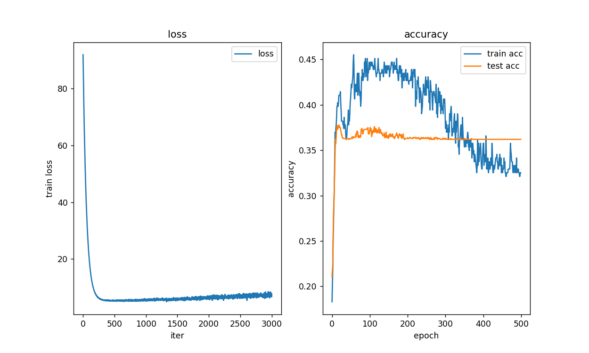

**以下使用sigmoid作为激活函数,从转却率可以判断,应该是出现了梯度消失现象.**

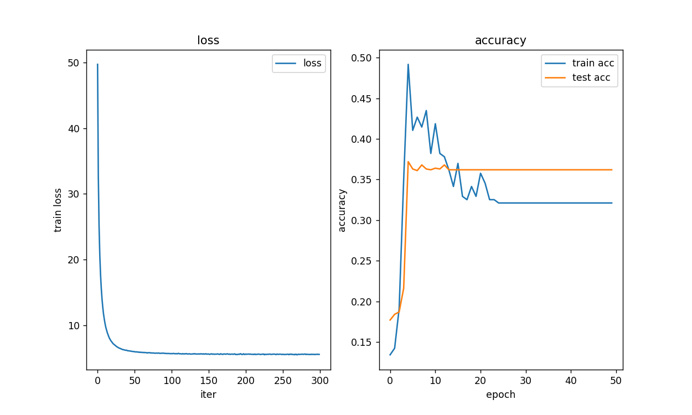

**以下不使用dropout方法,可以看到损失函数值先下降后上升,测试集准确率很高,而测试集准确率很低,应该是出现了过拟合现象.**

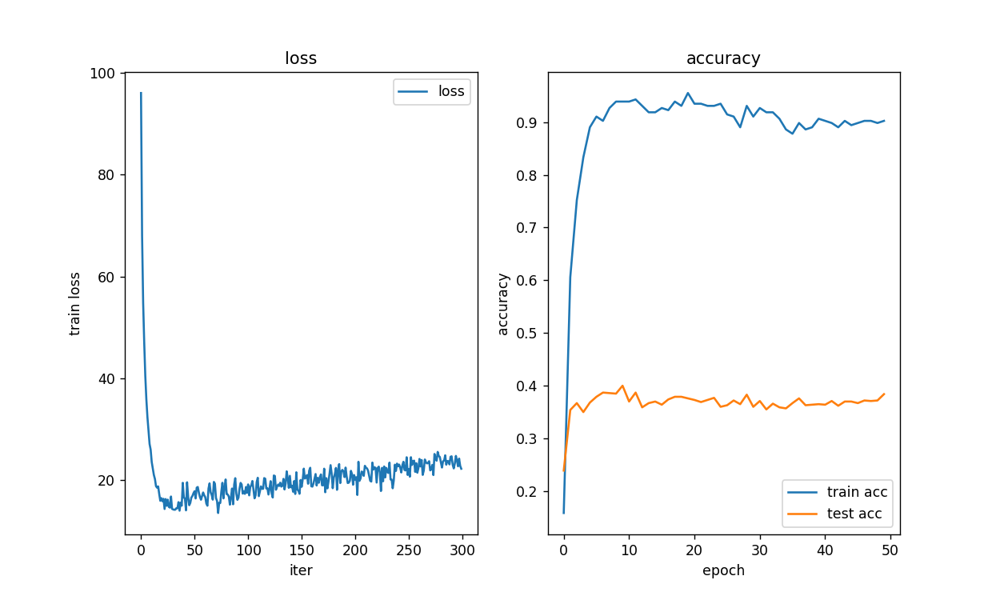

**以下是不适用dropout和batchnorm方法,可以看到损失函数值先下降后上升,但准确率一直没有变化,应该是出现了梯度爆炸问题.**

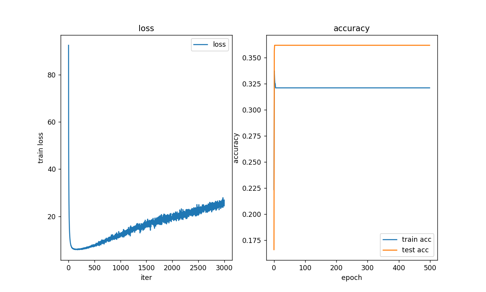

最后,经过反复测试 得到较好的参数和方法为如下.

```python
# 网络矩阵大小
input_size = len(x_train[0])
hidden_size_list = [100]
output_size = len(t_train[0])
# 网络参数
use_dropout = True  # dropout 方法
use_batchnorm = True  # 标准化
activation = 'relu'  # 激活函数
weight_init_std = activation  # 初始权值
weight_decay_lambda = 0.823  # 权值衰减系数
dropout_ration = 0.8  # dropout比例# 训练参数
epochs = 50
mini_batch_size = 40  # 40个 共246个数据 一个epochs会有两次循环 设置epochs为250 总共循环次数为500
optimizer = 'Adagrad'
optimizer_lr = 0.011
evaluate_sample_num_per_epoch = None
```

结果如下,学习能够正确进行,并且得到40%左右的较高准确率.

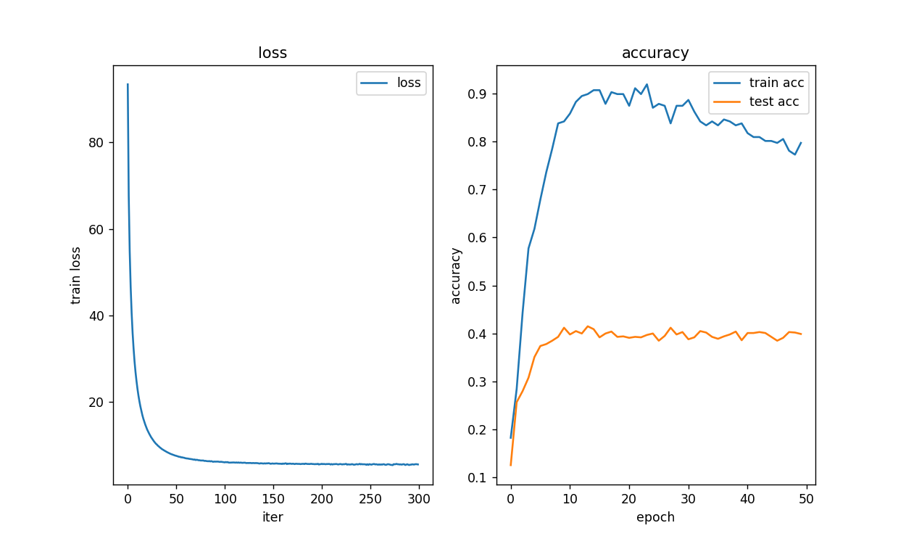

**|-----------如有优化，请重复1，2，分析优化后的算法结果-----------------------|**

# 四、思考题

无

# 五、参考资料

[TF-IDF 算法详解及 Python 实现_python tfidf_空杯的境界的博客-CSDN博客](https://blog.csdn.net/benzhujie1245com/article/details/118228847)

《深度学习入门：基于Python的理论与实现》
